# Tutorial Answers

## Basecalling 

### Basecalling using Guppy

#### 1. What’s the name of the configuration file guppy needs to basecall the tutorial data?

Show the list of all available configuration kits using

```
guppy_basecaller --print_workflows
```

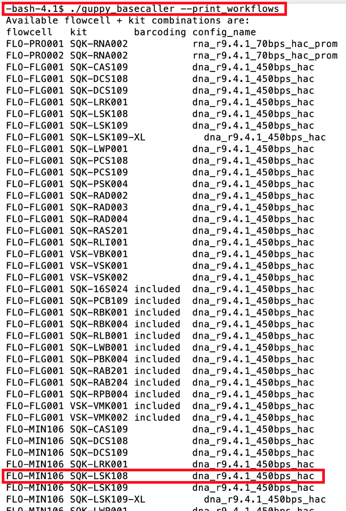

As mentioned the tutorial data was created using a *FLO-MIN106* flowcell and a *SQK-LSK108* library kit. Scrolling though the list will identify the config file *dna_r9.4.1_450bps_hac* as the appropriate basecalling model for tis flowcell+library-kit combination.

<div style="background-color:#fcfce5;border-radius:5px;border-style:solid;border-color:gray;padding:5px">
   
  The <i>_hac</i> in the model means it is the <i>High Accuracy</i> model. Additionally, you will always have to add the file extension <i>cfg</i> when calling guppy.
</div>

----

### Quality Control using FastQC

#### 1. How many reads are in the sample?

4725, as shown in the FastQC Window in the *Basic Statistics* tab.

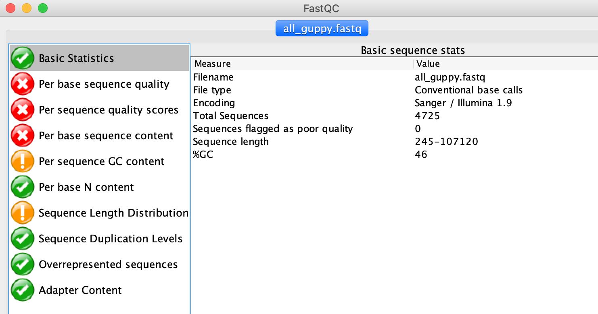

#### 2. What is the mean quality?

If you have a look at the *Per base sequence quality* tab the average q-score seems to be ~15, i.e., ~3% error probability, for most of the sequence parts.

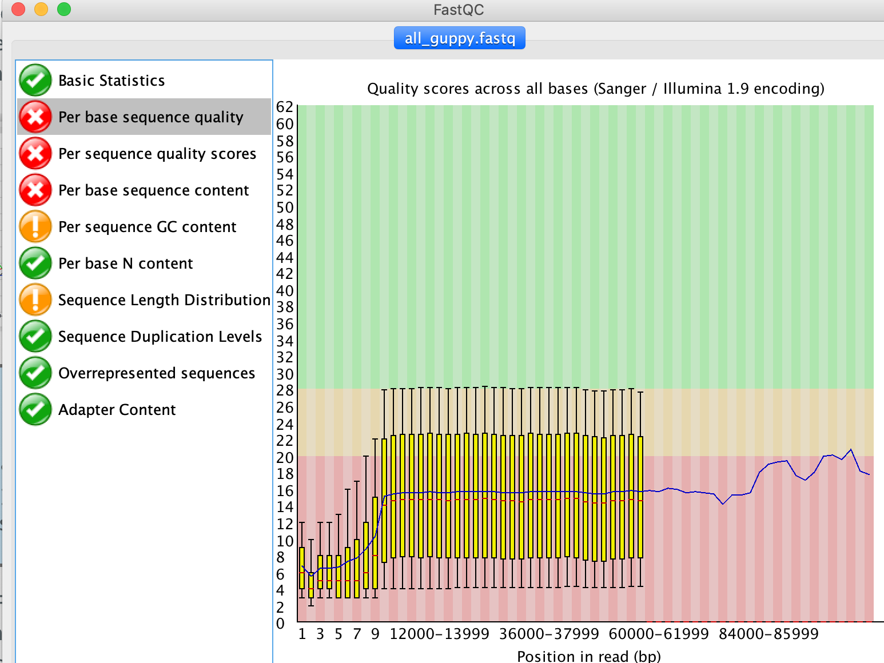

#### 3. Overall, how good is your data?

Overall, I'd consider the data ok from what I can see:
 * longest read ~100k (See Basic Statistics window) 
 * Average Q-score of 15 which is good
 
However, it would be good to also see a read length distribution and Qscore distribution before making that call.

#### 4. Are there areas that should be trimmed?

The *Per base sequence content* tab shows uneven distributions of bases in the starts of all reads. If the nucleotides at the beginning were randomly distributed (As they should be) then the A and T line should be approximately identical to the G and C lines (as they are in the rest of the plots). Diversion from this can indicate increased error rates as well as adapter or primer sequences that have to be removed.

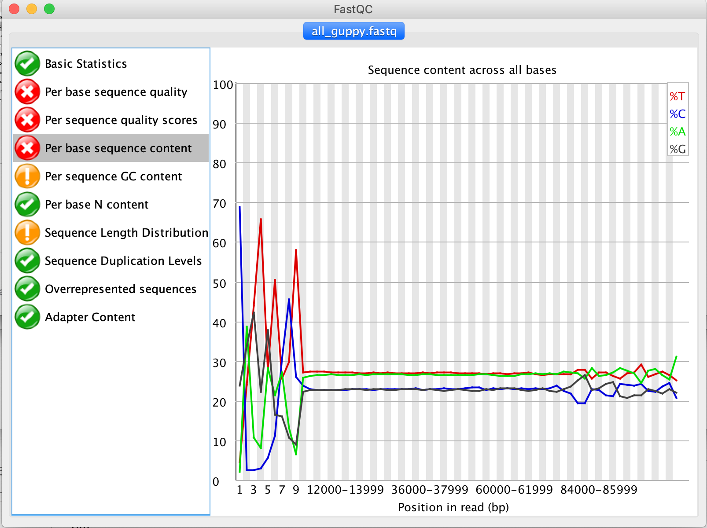

<div style="background-color:#fcfce5;border-radius:5px;border-style:solid;border-color:gray;padding:5px">
   
  The <i>Per base sequence content</i> assumes a relatively large number of reads to average over at each position. For low numbers of reads the distribution of AT and GC at each site will show a different pattern. For example, as indicated by the missing error bars in the last ~20,000 nucleotides only the longest read contributes to the plot which explains the less even sequence content lines.
</div>


#### 5. Are there any sequence parts that should be removed as part of the Quality Control step?**

As indicated by the *Adapter Content* tab some/all of the reads still contain PCR primers and sequencing adapters. These have to be trimmed/clipped as part of the QC process using tools such as Trimmomatic or Cutadapt.

----

### Quality Control using PycoQC

#### 1. How many reads do you have in total?

~270k reads in total (see the *Basecall summary* of PucoQC's output page

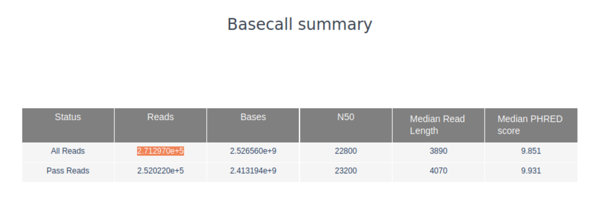

#### 2. What are the median, minimum and maximum read lengths, what is the N50?

The median read length as well as the N50 can be found for all as well as for all *passed* reads, i.e., reads that passed MinKNOWs quality settings, can be found in the basecall summary of PycoQC.

For the minimum and maximum read lengths hover look at the *Basecalled read lengths* plot. If you hover over the start and the end of the plotted length distribution you will see the length followed by the number of reads.
The minimum  read length for the passed reads is about 200bp, the maximum length ~130,000bp.

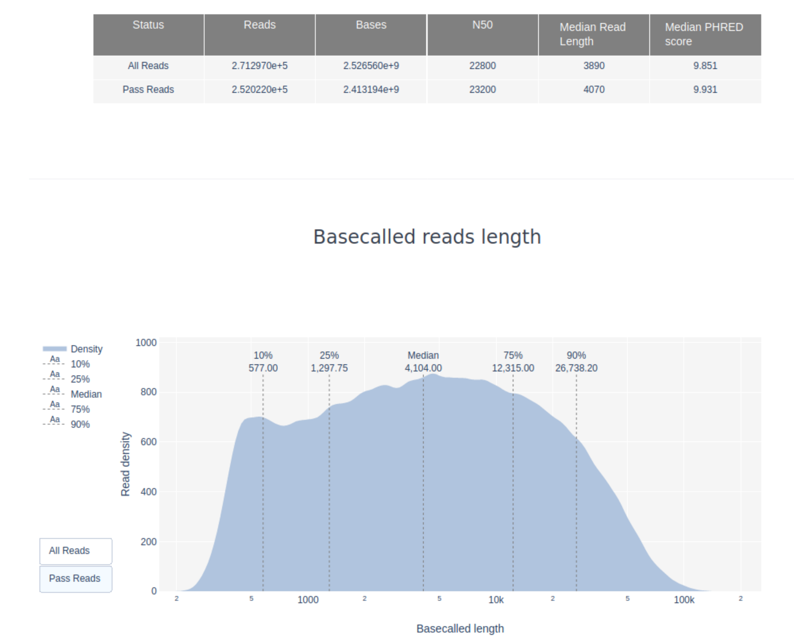

#### 3. What do the mean quality and the quality distribution of the run look like? Remember, Q10 = 10% error rate

The majority of the reads has a Qscore of <10, i.e., an error rate of >10%. Given that the tutorial data was initially basecalled with Oxford Nanopore's old basecaller Albacore these results are normal. However, as seen in the previous tutorial, the average QScores of data basecalled with Guppy is usually much higher.

#### 4. Have a look at the “Basecalled Reads PHRED Quality” and “Read length vs PHRED quality plots”. Is there a link between read length and PHRED score?

In general, there is no link between read length and read quality. However, in runs with a lot of short reads these the horter reads are sometimes of lower quality than the rest.

#### 5. Have a look at the “Read Length over Experiment time” plot. Did the read length change over time? What could the reason be?

In the current example the read length increases over the time of the sequencing run. This is especially true for libraries that show a wide spread in the length distirbution of the molecules. One explanation is that the adapter density is higher for lots of short fragments and therefore the chance of a shorter fragment to attach to a pore is higher. Also, shorter molecules may move faster over the chip. Over time, however, the shorter fragments are becoming rarer and thus more long fragments attach to pores and are sequenced.

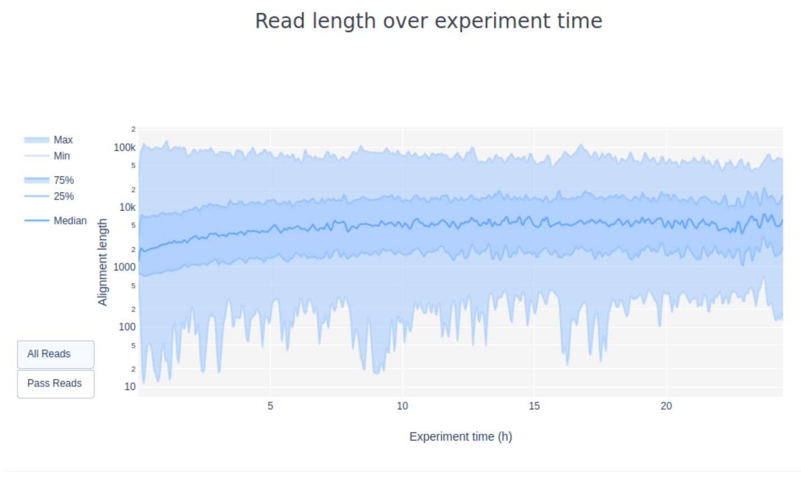

<div style="background-color:#fcfce5;border-radius:5px;border-style:solid;border-color:gray;padding:5px">
   
  This effect will be minimised or removed if a flow cell is re-primed/re-loaded with more library, of course, as it will reload short fragments. Additionally, sheared and size-selected libraries will not show the same effect as they have a narrow molecule-length distribution.
</div>

#### 6. Given the number of active pores, yield over time, and channel activity over time, do you think this was a successful sequencing run? Why/why not?

A look at the *Channel activity over Time* plot already gives a good indication of the run quality: it's crap! The vast majority of channels/pores are in-active (white) throughout the sequncing run. You would hope for a plot that is dark on the X-axis and with higher Y-values (increasing time) doesn't get too light/white. Depending if you chose "Reads" or "Bases" on the left the colour indicates either number fo bases or reads per time interval

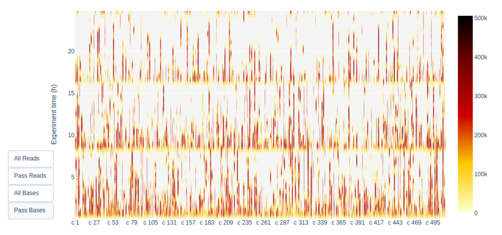

Additionally, the "Cummulative" plot area (light blue) in the *Output over experiment time* indicates that 50% of all reads and almost 50% of all bases were produced in the first 5h of the 25h experiment. Although it is normal that yield decreases over time a decrease like this is not a good sign.

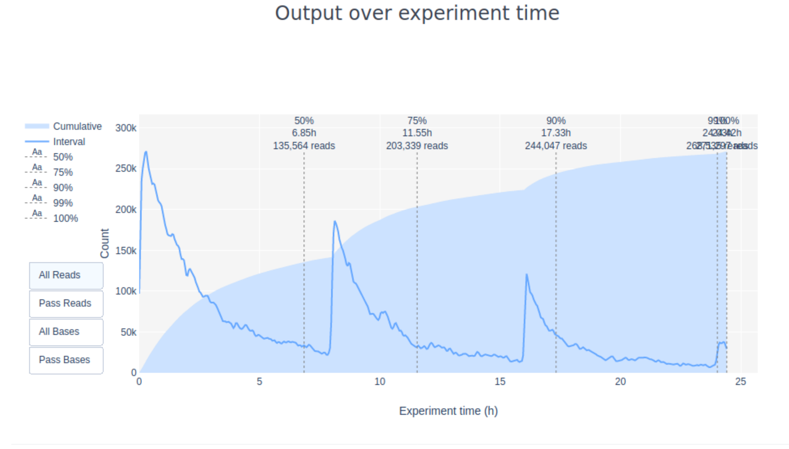

#### 7. Inspect the “output over experiment time” graph. Can you explain the shown curve-pattern? Would you have stopped the run earlier? Think about how the MinION works, especially with regards to adjustment of the applied currents.

As you might know (or should?) Nanopore sequencing works as follows:
 * a membrane separates two chambers (above and below the membrane) with different electronic potential.
 * when sequencing charged particles flow from the upper chamber through the pores into the lower chamber
 * over time the flow of particles from the upper to the lower part of the membrane equalises the charge on both sides, hence over time a higher current has to be applied to "suck" the charged particles from one side of the membrane to the other
 * Additionally, over the course of a sequencing run the membrane pores may "die" and become inactive.
 
That means that the MinKNOW software does two things:
 1. Increase the negative voltage applied to the flowcell in 5mV steps every 2 hours (starting from -180mV)
 2. Switching to a new group of pores for sequencing every 8h (this depends on software version and demuxing settings)
 
Both events can increase the yield drastically (especially for sub-optimal libraries) although a change of the mux-group or *re-muxing* will have the bigger effect.

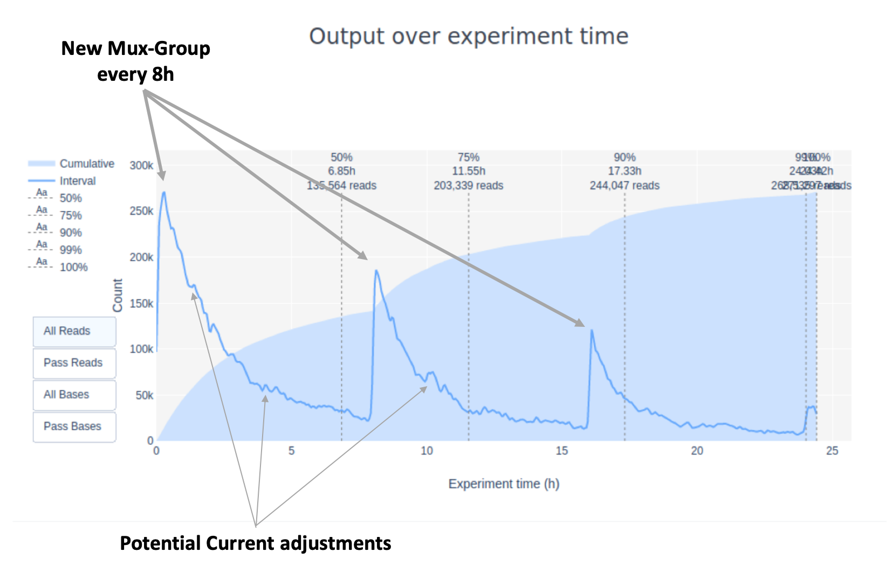

Additionally, this flow cell included 3 different runs on different days with 

As already mentioned in the question before the stats show that this library was not great. Options would have been
 1. Immediately stop the run, wash the flowcell and re-do DNA extraction to not waste your flow cell (Best solution)
 2. Re-mux the pores every 2 hours to increase yield and stop as soon as most pores are gone (waste of flow cell but at least increases yield as much as possible)
 3. Stop after 5h or at latest 10h when >70% of the data are produced. Running the flow cell another 10h without producing much data was definitely a waste of flow cell
 
#### 8. If you want to you can generate the PycoQC plots for run_3/sequencing_summary.txt and compare it to run_1. What are the differences?
 
 One of the main differences is that run_3 includes reads from not just one but 18 runs (see RunIDs in the summary table) and the cummulative sequencing time is >60h.
 
 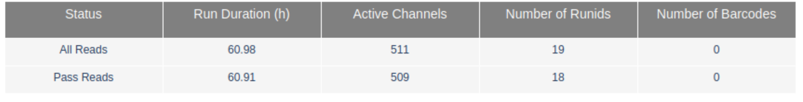
 
 Additionally, this flow cell included 3 different libraries run on different days and for each library the run was stopped and re-started several times to force a re-mux of the pores. The *Read length over experiment time* clearly shows the start of each new library
 
 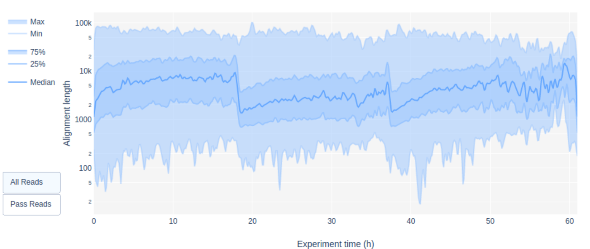
 
 Additionally, the yield over time plots shows several peaks in the first 10h of sequencing whenever the run was re-started.
 
 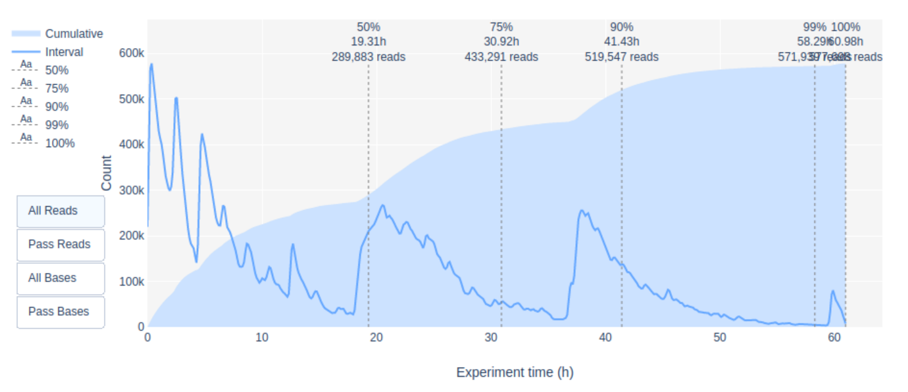
 
 which was also correlated with a better pore activity
 
 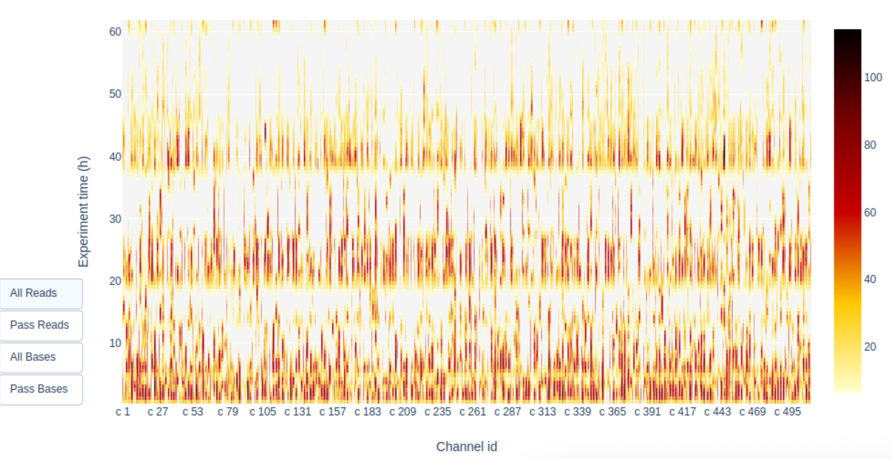

However, despite increased yield and pore activity in run_3 it is still far from being a nice run!

----

 ### Quality Control using MinIONQC
 
 #### 1. Does the yield over time increase or decrease? Is any of the runs more consistent than the others?
 
This quesiton is pretty ambiguous (thanks Tim). The yield over time increases, of course, because we're not loosing any data over time. However, the increase per time, e.g. hour, decreases over the duration of the sequencing run. As mentioned before this has several reasons including decreasing pore activity and decreasing fragments/library (in case it's not re-loaded during the run). However, the "nicest" run is run_3 as the decrease in sequencing yield per hour is slowest and the overall yield is highest.

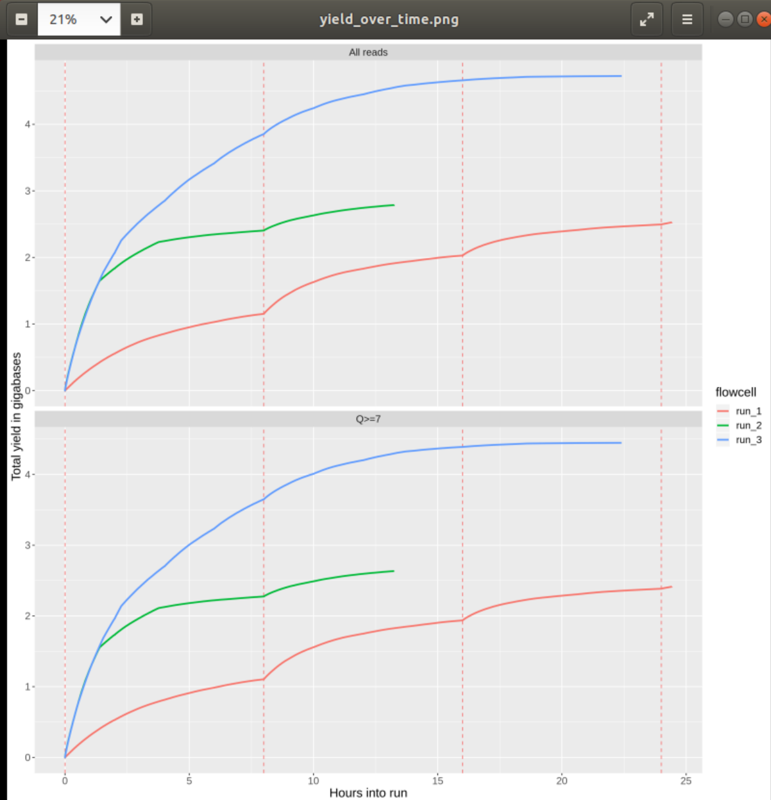
 
 #### 2. Inspect the plot q_by_hour.png and check the quality of the reads of each run over time. Assuming that the runs represent different library preparation protocols, would you favour any of them? Why?
 
In all runs the quality score decreases over time. This has been reported for different MinION chemistries <sup><a href="https://www.ncbi.nlm.nih.gov/pmc/articles/PMC5538040/">1</a></sup> but may be reduced in more recent flow cells or with re-loading of library.

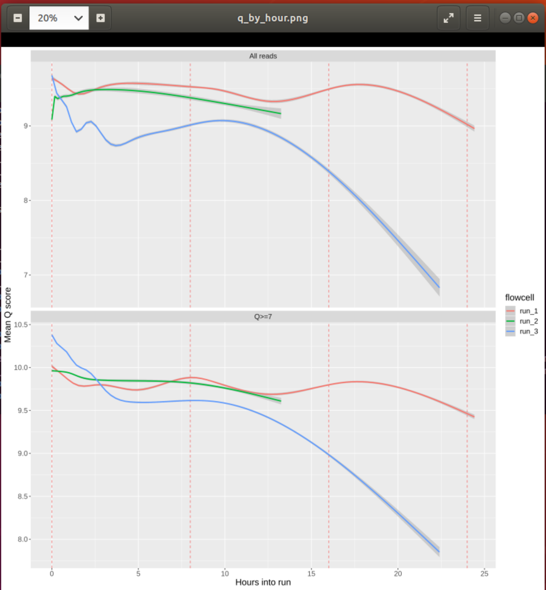

Overall, run_1 seems to show the most consistent Q-score over time and would therefore be preferred. However, given that the yield of run_3 is double that of run_1 (see previous question) one could argue that we get an equal amount of "good" reads from run_3 plus a lot of not that great ones, which might be preferred. 

----

### Adapter Removal using PoreChop

#### 1. How many adapters did porechop remove?

A total of 4082 reads where <i>chopped</i>: 3,329 reads with adapters at the start and 753 from the end of the read.

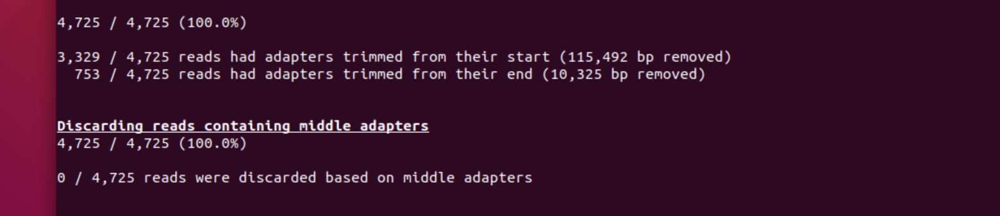

#### 2. Did it discard any reads? Why not?

The test data was created using a !d library, i.e., only one strand of each molecule was sequenced. The "middle" barcode is (usually) only found in 2D libraries where both strands are linked and sequenced consecutively. Hence, porechop did not discard any reads with adapter in the middle.


#### 3. Inspect the different graphs. Did the porechop step improve the data? If so, which parts were improved?

FastQC shows that, according to the FastQC parameters/thresholds, porechop improved the <i>Per base Sequence Content</i> as well as the <i>Kmer Content</i>. Adapters will bias the base distribution at the beginning of the reads towards the adapter sequence, which is the reason for the <i>spiky</i> graphs in the <i>Per base Sequence Content</i>. Removing the adapters levelled the graphs somewhat. 

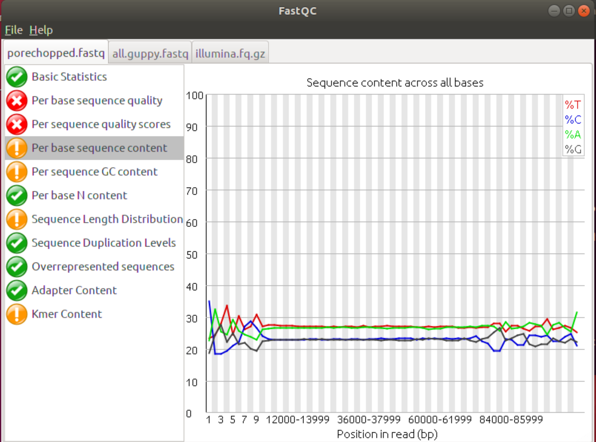

Similarly, to the <i>Overrepresented Sequences</i> tab the <i>Kmer Content</i> tab shows whether certain Kmers (sequences/words of length <i>K</i> are over-represented at certain positions in the data. This feature can show short over-represented sequences that would not have been picked up otherwise. Again, the removal of adapters will eliminate overrepresented Kmers at the beginning of the sequences.
  
  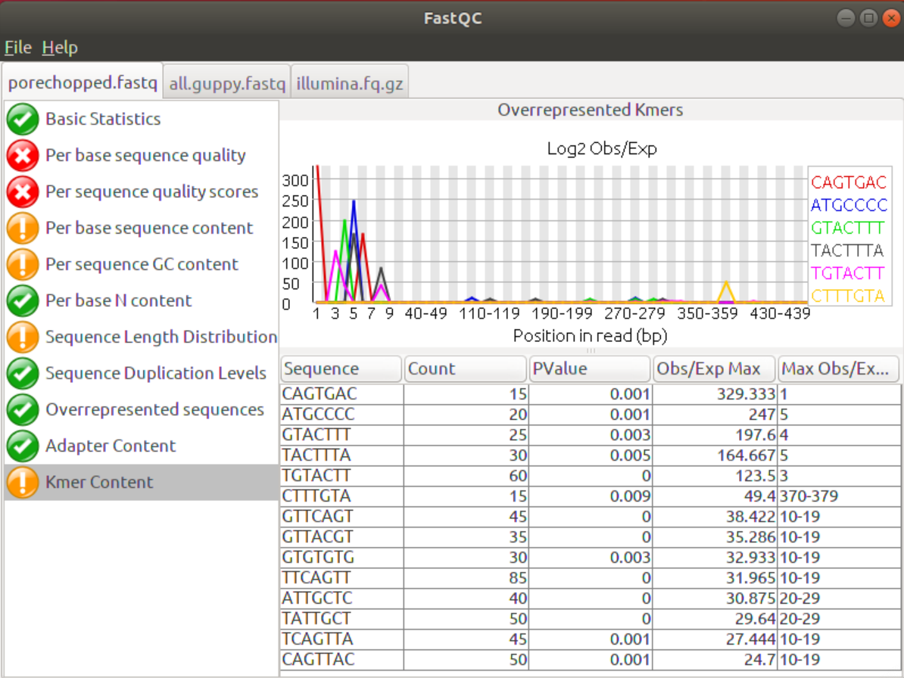

#### 4. Are there still areas of the sequences that you’d like to improve?

It seems that the beginnig of the data is still somewhat biased so one could try to trim the start even more. One way would be to <i>hardclip</i> a certain number of nucleotides from all reads, i.e., remove those nucleotides. Given that most Oxford Nanopre adapters are <25 nucleotides this may be a good alternative for porechop in general, potentially using the tool introduced in the next tutorial, <i>NanoFilt</i>.

----

### Read trimming and filtering using NanoFilt

#### 1. Use FastQC to check the result file and compare it to the porechopped file and the original guppy fastq. Did NanoFilt improve the data? 

Although it's only a small change the data did improve, especially the <i>headcrop</i> of the first 25 nucleotides improved the <i>Per base Sequence content</i>. Addiitonally, the Kmer content shows fewer Kmers at the beginning that are conserved. The last few Kmers may be due to acutal overrepresentation in the data set, e.g. throuh sequencing bias or repeat regions in the genome.

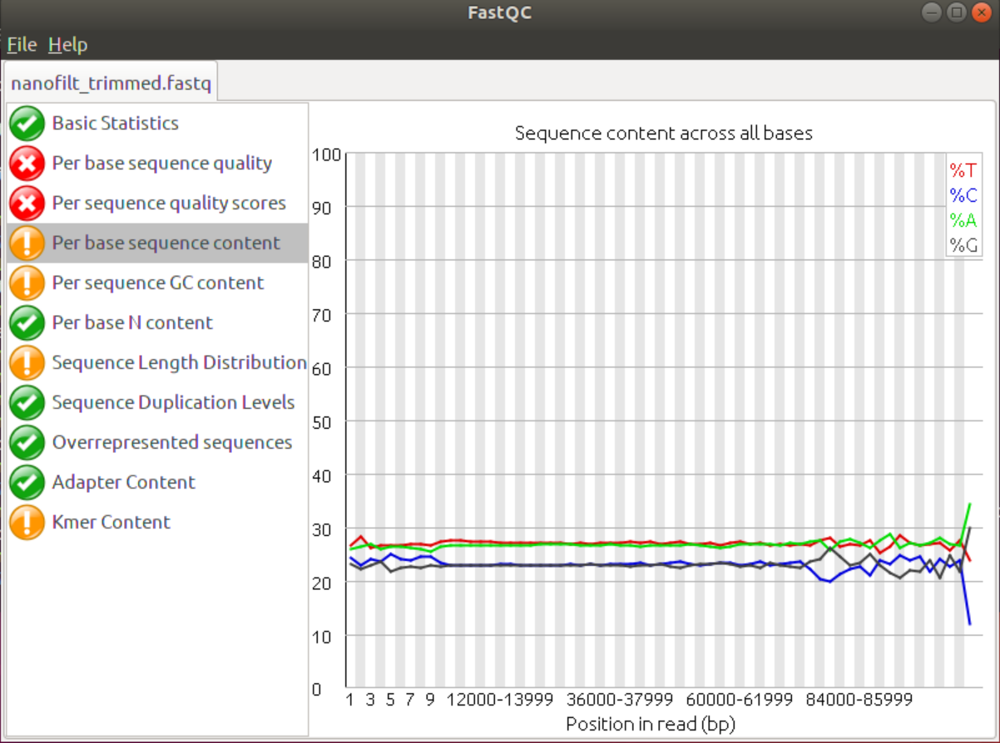
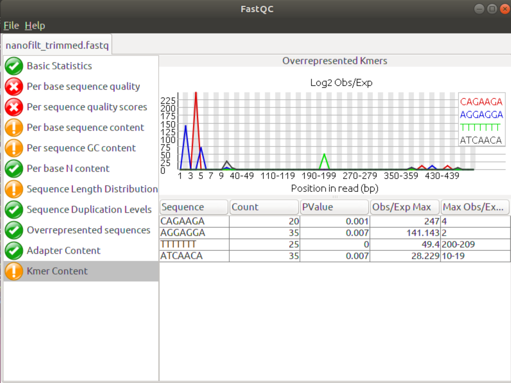

Also, the average quality score in the start was improved.

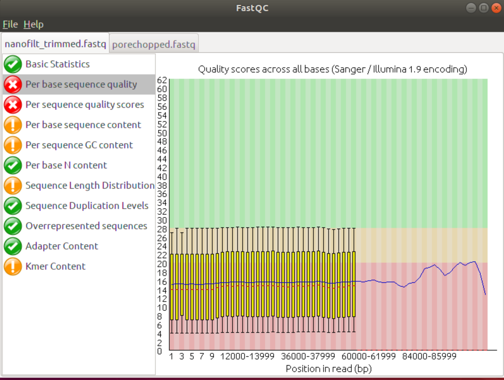

----

### Genome Assembly with Minimap2 and Miniasm

#### 1. How many unitigs are there and what is the length of the longest one?

The fasta file contains 8 unitigs (n = 8) and the longest unitig is 474,411 nucleotides long.

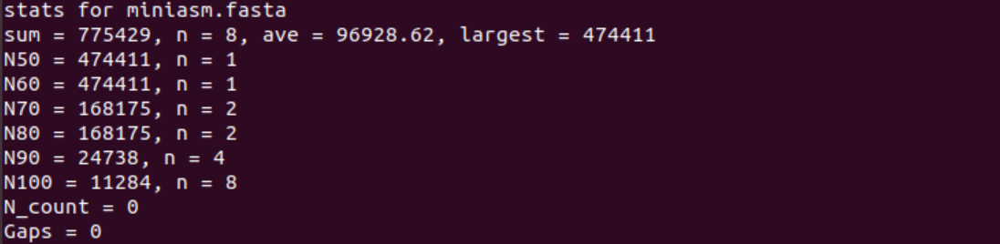

#### 2. How many of the miniasm sequences align with the reference?

5 out of 8 

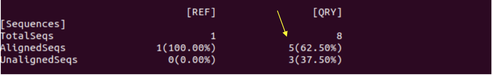

#### 3. What is the average %-identity of the miniasm assembly compared to the reference? Would you have expected this %-identity?

Depending of whether you use the <i>1-to-1</i> or the <i>M-to-M</i> statistics the %-identity is either 88.13 or 88.12, respectively. 

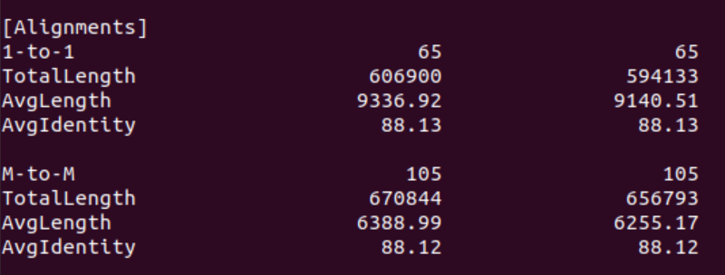

The low %-identity of the assembly when compared to the "truth" (reference) is expected because miniasm does not perform any kind of error correction or consensus sequence building. Thus, the error rate of the resulting assembly is identical or similar to the error rate of the input reads. 

<div style="background-color:#fcfce5;border-radius:5px;border-style:solid;border-color:gray;padding:5px">
   
  The difference between is that the <i>1-to-1</i> relationship only counts those alignment blocks that are bidirectional, i.e., hits reference->query as well as query->reference. In contrast, the <i>M-to-M</i> option (many-to-many) also counts alignment blocks that are only found in a reference->query or query->reference direction. Thus the M-to-M option is a <i>superset</i> of the 1-to-1 option that maximises the coverage of all alignments at the expense of %-indentity.
</div>

#### 4. How many of the miniasm unitigs align with the reference?

Given that the Assemblytics dot-plot is a visualisation of what we already saw int he report file the answer is again "5". However, the Assemblytics dot-plot shows that only 2 of the unitigs align over the majority of the sequence with the reference without (major) disruptions or INDELS: utg00004l and utg00001l. The dot-plots also show two repeat regions in the beginning of the sequence (the red crosses in utg00004l).

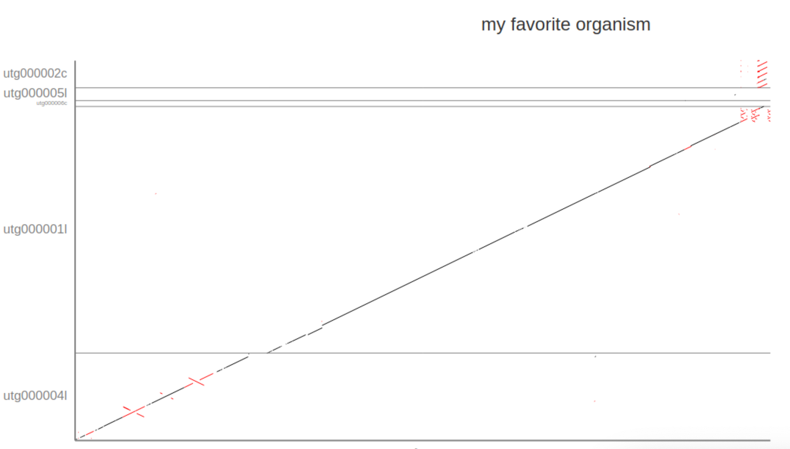


#### 5. Does the miniasm assembly cover the complete reference?

Overall the assembly covers almost the complete sequence as show in the diagonal line starting at 0/0 (lower right corner) and continuing through utg00004l and utg00001l to the end of Chr17. However, it seems that a small part at the transition between the two unitigs is missing, represented by a break and shift to the right in the diagonal line.

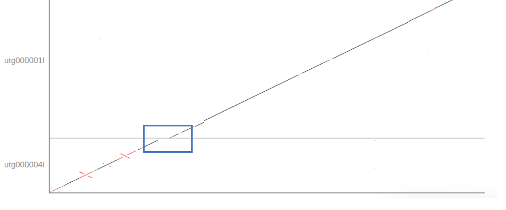

#### 6. What could the repetitive region at the end of chromosome 17 be?

One potential explanation could be that the assembly includes a telomere-sequence, repeat sequences at the end of chromosomes that protects the single-strand overlap of the DNA against degradation. A common telomere sequence in eukaryotes is (TTAGGG) * N. 

----

### Genome assembly using Flye

#### 1. Does the assembly differ from the miniasm assembly, e.g., wrt total length, number of contigs and length of the contigs?

Yes, the Flye assembly results in more than 4 times the number of contigs (33) and the largest contig is also longer than the miniasm assembly (681,342 nucleotides). However, the average length of the contigs is ~20k nucleotides shorter in the Flye assembly (~73k) in comparison to the miniasm assembly (~96k).

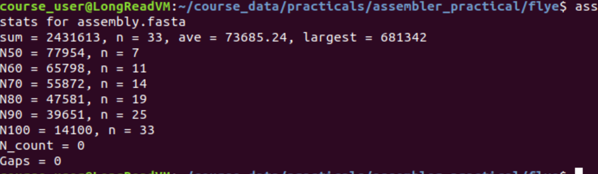

#### 2. How many contigs aligned with the reference? What is the error rate?

Of the 33 contigs in the Flye assembly 31 aligned to the reference. Interestingly, as can be seen in the <i>Bases</i> statistics only ~30% of all the bases in the Flye assembly aligned to the reference. Thus, the two unaligned contigs seem to be contain ~70% of the bases.

As expected the error rate of the Flye assembly is much lower than the miniasm assembly because Flye also includes a consensus sequence step which decreases the 1-to-1 error rate to <1% and the M-to-M error rate to <2%.

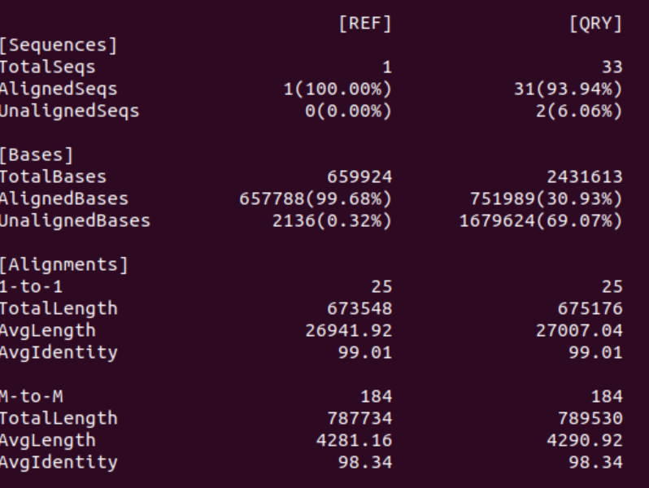

#### 3. How many contigs align well with the reference?

Although the report shows 33 contigs that align to a certain degree with the reference the assemblytics dot-plot shows that only one contig alignes significantly with the reference: contig_2. 


#### 4. Does the alignment differ from the reference, e.g., does the Flye assembly extend the start or stop of the reference? Are there inversions? 

If you zoom in on contig_2 (click ont he name) it seems that contig_2 extends the reference (slightly) at the start (the diagonal line starts at >0 on the Y-axis). 

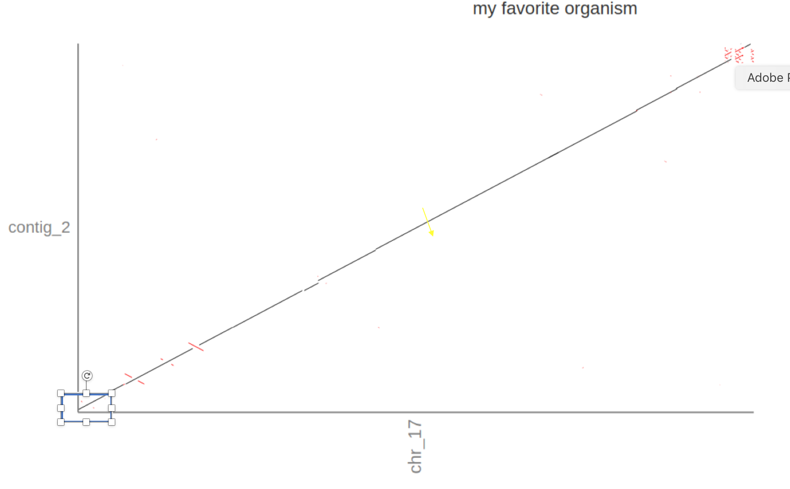


