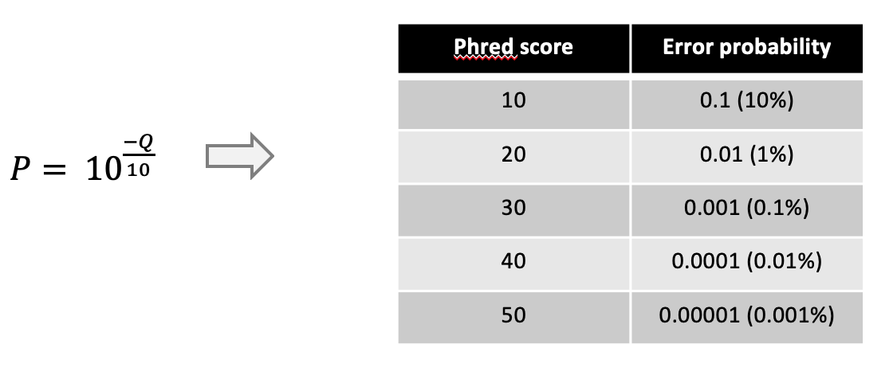

# Metrics

[](APP_MET.md) [](index.md)

This page explains a few common metrics used in genetics & genomics.

## N50

The N metrics are a measure of contiguity of a set of sequences often used to assess genome assemblies.

The N50 is related to the median and mean length of a set of sequences. Its value represents the length of the shortest read in the group of longest sequences that together represent (at least) 50% of the nucleotides in the set of sequences.

Example:
Six reads of length 10, 11, 12, 13, 14, 15, 16. 
The combined length is 81 nucleotides and 50% = 40.5 nucleotides.

To get the N50 value start at the longest read and add the length of the next shorter one until you reach (at least) 50% of the total number of nucleotides:

		16 + 15 + 14 = 45

The N50 value of this set of sequences is 14. 
 
The N50 value can be seen as a weighted midpoint of the read length distribution of a sequencing run. However, the N50 value has to be interpreted in context of the total number of reads in a sequencing run. For example, a large number of very short reads may not have a big impact on the N50 value of a sequencing run but would arguably be worse than a sequencing run with less reads and similar N50 value.

Another common metric is the N90 value, representing the shortest read in the group of longest reads that together represent 90% of all the nucleotides.

In the example above the N90 value is 10.

   
  N50-values alone can be mis-leading are on its own is not a useful measure to assess the quality of an assembly. For example, the assmblies with the following contig lengths have the same N50 although one is more contiguous than the other: 
  <ul>
    <li>3, 3, 3, 3, 3, 3, 3, 3, 3, 3, 25, 25, 150, 1500</li>
    <li>50, 500, 530, 650</li>
  </ul>
  As shown above, many short reads in an assembly may not affect the N50 which is one of the reasons why the N50 (alone) is not a useful metric to assess or compare assembly qualities.

----

## PHRED score

Phred scores are a measure of the quality of a sequencer’s base calling. It represents the logarithmic probability of a sequencing error for each nucleotide. Phred scores (Q) in a fastq file are represented as [ASCII](https://en.wikipedia.org/wiki/ASCII) text to be able to assign one character to each nucleotide. In nanopore data the phred score is given as the integer value for the error probability P can be calculated through

Due to this the error probability for each nucleotide in a fastq file can be represented by a single character in line 4 of each sequence.
