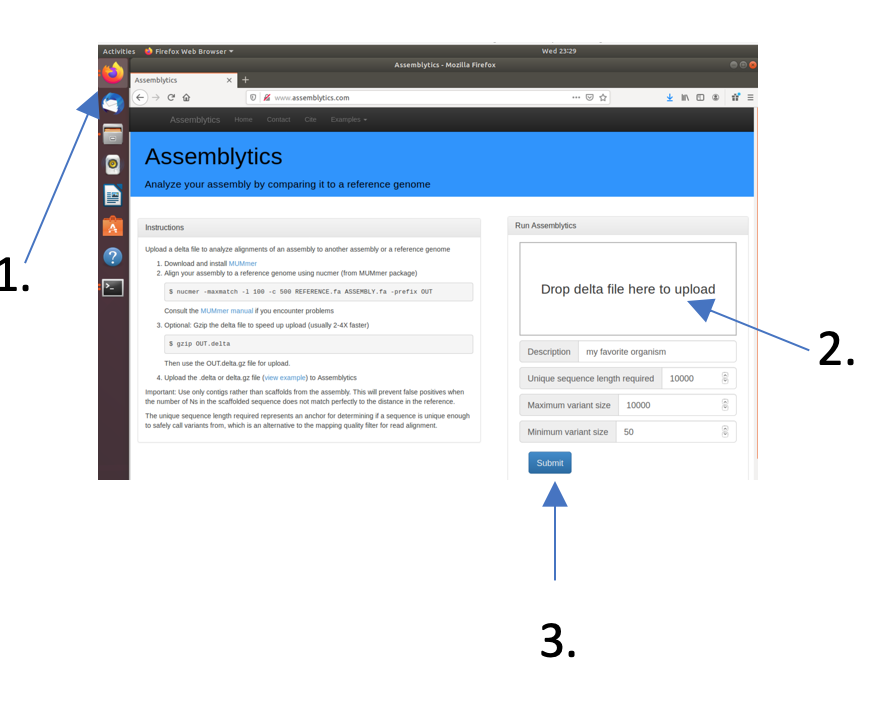
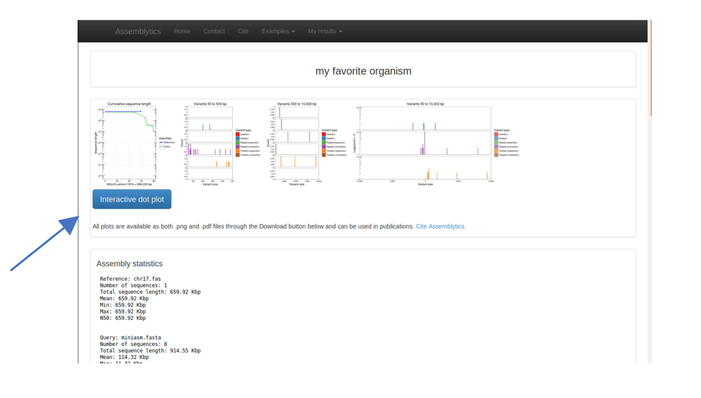
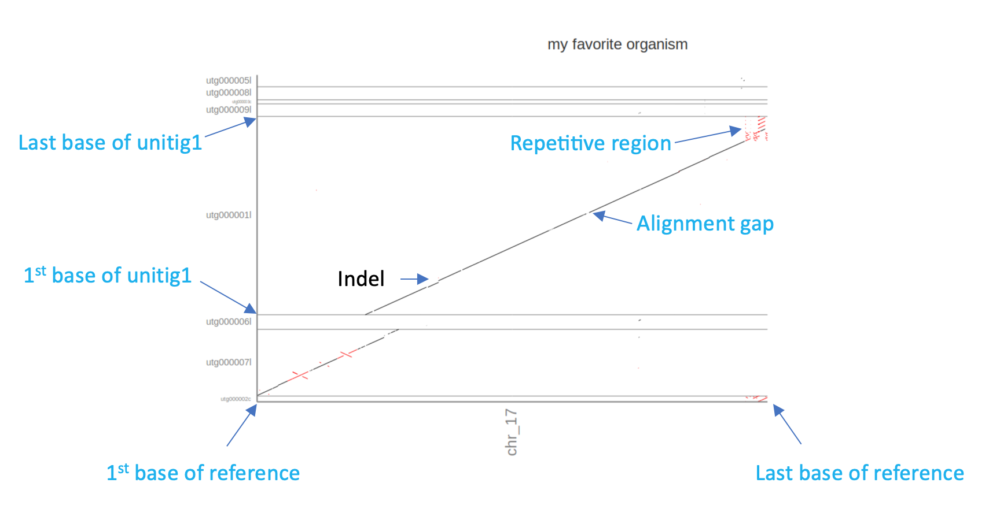

# Genome Assembly with Minimap2 and Miniasm 

[](ASS.md) [](index.md) [](ASS_F.md)

The minimap2-miniasm pipeline is an incredibly fast and memory efficient way of assembling Long-Read data. However, it has several characteristics that differ from other assemblers:

 1. Miniasm outputs *unitigs* not *contigs*. Unitigs are *unique* parts in the assembly graph. This means all reads in your data "agree" on this part of the assembly. One could say they are high-confidence contigs. In contrast, *contigs* may include regions with ambiguous read information, depending on the algorithm used. As a result unitigs can be shorter and the miniasm assemblies more fragmented
 2. Miniasm does not build a consensus sequence of the assembly. Thus, the error rate of the resulting unitigs is approximately the same as the error rate of the raw reads.
 
First use minimap to map the filtered nanopore reads onto themselves. This will identify overlaps between read. Change into the directory *assembler_practical/minimap_miniasm* in the practical directory and map the reads using

```
minimap2 –x ava-ont \
 ../../trimming_practical/nanofilt/nanofilt_trimmed.fastq \ 
 ../../trimming_practical/nanofilt/nanofilt_trimmed.fastq \
| gzip -1 > ./minimap.paf.gz
```
<br>
<div style="background-color:#fcfce5;border-radius:5px;border-style:solid;border-color:gray;padding:5px">
   
  The “\” at the end of each line is only for convenience to write a long command into several lines. It tells the command-line that all lines still belong together although the are separated by “enter” keys. However, if you type all of the command, i.e., paths etc, in one line don’t’ use the backslash at the end of the lines.
</div>

The above command will compare all filtered reads in the fastq file against themselves. Additionally, the output will be passed to the tool gzip (gzip -1) to compress the output and redirect (>) the output into a file called minimap.paf.gz. 

Use the minimap output and the trimmed reads to assemble unitigs with miniasm:

```
miniasm -f \
../../trimming_practical/nanofilt/ nanofilt_trimmed.fastq \
./minimap.paf.gz > miniasm.gfa
```

Miniamp and miniasm do not provide an option for output files but instead write the output directly to the terminal, hence the redirection (>).
The output of miniasm is a column based file in gfa format. It contains the name of a unitig in column 2 and the sequence in column 3. To convert the miniasm.gfa file into a fasta file of unitigs use the following awk command

```
awk ’/^S/{print “>”$2”\n”$3}’ miniasm.gfa > miniasm.fasta
```

This will create a fasta file with all assembled unitigs called miniasm.fasta. 

But what does the assembly look like? 

### Check the assembly using *assembly-stats* 

To get some basic assembly statistics use the tool *assembly-stats*.

```
assembly-stats ./miniasm.fasta
```

Assembly-stats reports basic statistics about all sequences in a fasta file, e.g. N50, longest sequence, total number of nucleotides etc. 

<div style="background-color:#cfedfe;border-radius:5px;border-style:solid;border-color:gray;padding:5px">
   
  <ol>
   <li>How many unitigs are there and what is the length of the longest one?</li>
 </ol>
</div>

The quality of assemblies can be assessed using many different metrics such as the percentage of reads that map to the assembly, N50, L50 and others. However, in this case we’ll assess the quality of the assembly by comparing it to the published reference. In directory *~/course_data/precompiled* you will find the published sequence of chromosome17 (chr17.fas) of the marine diatom *Thalassiosira pseudonana*, the source of most of the reads used in this tutorial.

First get some assembly statistics. Use assembly-stats to get an overview over chromosome17, e.g., number of nucleotides and number of Ns (gaps or ambiguous sequences). 

Compare the two statistics. Do some of the miniasm unitigs match the reference sequence in length?

### Compare two assemblies using *Mummer/DNADiff* 

To compare the miniasm assembly to the reference genome use the tool dnadiff that is part of the Mummer package. Mummer is a fast aligner that can align complete genomes in relatively short time.

```
dnadiff -p dnadiff ~/course_data/precompiled/chr17.fasta miniasm.fasta
```

The above command will align the chr17 sequence with the miniasm unitigs in the fasta file and produce a series of output files that all start with the prefix *dnadiff*. Open the file *dnadiff.report* (e.g. by navigating to the folder and double-clicking it) to see a report of the analysis. 

<div style="background-color:#cfedfe;border-radius:5px;border-style:solid;border-color:gray;padding:5px">
   
  <ol start="2"> 
   <li>How many of the miniasm sequences align with the reference?</li>
   <li>What is the average %-identity of the miniasm assembly compared to the reference? Would you have expected this %-identity?</li>
 </ol>
</div>


### Comparing two assemblies using *Assemblytics* Dot-Plots 

Multiple tools also provide visual representations of the mummer output. Here we will use the online tool  Assemblytics  to visualise our comparison.

Open Firefox and go to www.assemblytics.com and click on the “Drop Delta file here for upload” field. Navigate to the directory with your miniasm assembly and select the dnadiff.delta file. When the Upload is done (the progress bas has to disappear) press the “Submit” button. 



On the next screen press the green “Continue” button. As soon as the analysis is finished a series of plots and statistics will appear. You can inspect those, if you like. However, for the moment we are more interested in the “Interactive Dot Plot”




### Dot-Plots Explained

A dot-plot is a visual representation of the similarity of two or more sequences. Each of the two axis represent one sequence starting at the first nucleotide in point 0/0 (where the the x-axis and the y-axis meet) and ending at the last nucleotide, i.e., the end of each axis. In a dot plot a "dot" is drawn on the plot if the location at position "x" in sequence 1 is similar to location at position "y" in sequence 2.

In this case the resulting dot-plot shows the miniasm unitigs on the y-axis and the reference sequence of chr17 on the x-axis. Sequence parts that align and are in the same order are shown as diagonal lines. Similarly, orthogonal lines (upper left to lower right) indicate inversions in one of the sequences. Breaks and gaps in the line indicate Insertions and deletions (Indels) or generally unaligned regions.




Based on the Assemblytics dot-plots:

<div style="background-color:#cfedfe;border-radius:5px;border-style:solid;border-color:gray;padding:5px">
   
 <ol start="4">
  <li>How many of the miniasm unitigs align with the reference?</li>
  <li>Does the miniasm assembly cover the complete reference?</li>
  <li>What could the repetitive region at the end of chromosome 17 be?</li>
 </ol>
</div>


