# Assembly Improvements using Bandage 

[](VC_S.md) [](index.md) [](APP.md)

Despite ever improving sequencing methods and increasing numbers of “chromosome finished” genome assemblies in most cases the initially produced assemblies will be fragmented mostly due to loops in the assembly graph. One way of improving the contiguity of the assembly is to inspect the assembly graph output of the assembler program. Bandage supports assembly graphs in gfa format the is supported by many assemblers including miniasm, flye, Spades, Masurca and others..

Change into the *bandage_practical* directory and type “Bandage”. This will open the GUI of the program. 

Use File->Load graph  to load the file *Bandage_prac.gfa* in the *bandage_practical* folder.

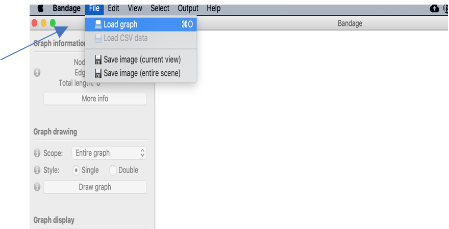

After the gfa file is loaded press the Draw graph button to visualise the assembly graph.

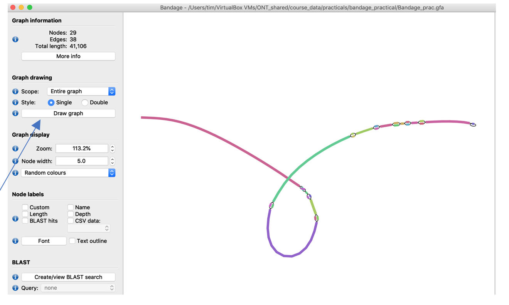

   
  The shown graph is very very very small! Common assembly graphs look more like a fur ball.  For large assemblies it is useful for only draw parts of it, e.g. by selecting “Around nodes” and specifying the node names, instead of drawing the complete graph. Bandage can get pretty  slow for large assembly graphs!
 
Don’t worry if the graph in your application looks different from the pictures: everytime press the Draw graph button again the graph will look slightly different in orientation.

The provided assembly consists of several longer sequences (colourful bars in the bandage picture) that are interrupted by *bubbles* in the graph. One potential cause for bubbles in the graph can be unresolved repeats. Let’s inspect them a little more: 

In the Node labels  menue on the left tick the Depth checkbox to show the sequencing depth of all sequence parts.

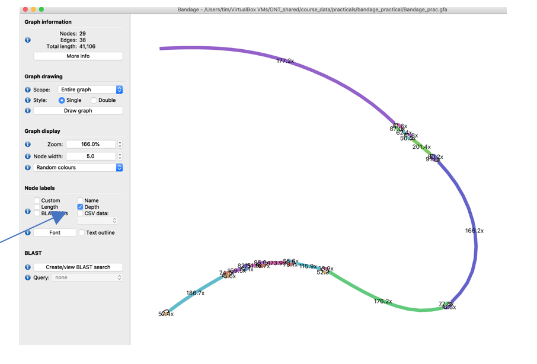

For better readability pull the nodes of the different bubbles further apart by clicking and holding a node and pulling it to a new position

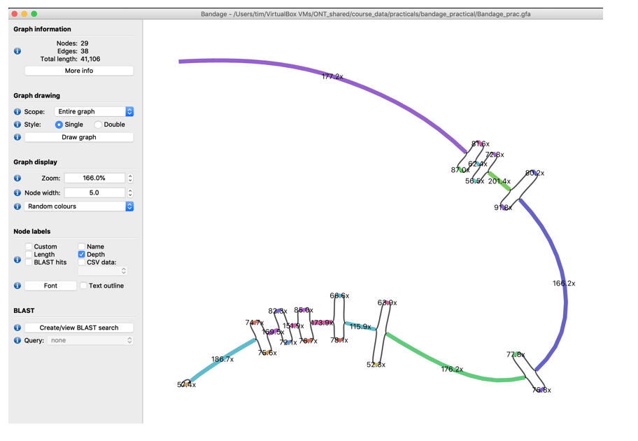

   
  <ol>
   <li>Inspect the coverage of the different bubble nodes. Do you recognise a pattern?</li>
   <li>What could cause these bubbles? Do you think it’s repeats? (If you don’t already guess it take a few minutes to think about it especially about the coverage difference between the bubble and non-bubble elements of he graph)</li>
 </ol>

Another source of bubbles in the assembly graph are sequencing errors, of course, but also different alleles in di- or polyploid genomes. For a diploid genome we would expect that the heterozygous positions in the assembly show approximately half the coverage to conserved parts of the genome. 

To check if this is true we could check whether the bubbles connect parts of a gene with similar function and, if so, this could indicate either different alleles or in microbial communities, orthologs of different isolates.

1. Select node “65939199” (the names of the nodes are shown in the Selected Node window on the right (It’s the third-last non-bubble node)

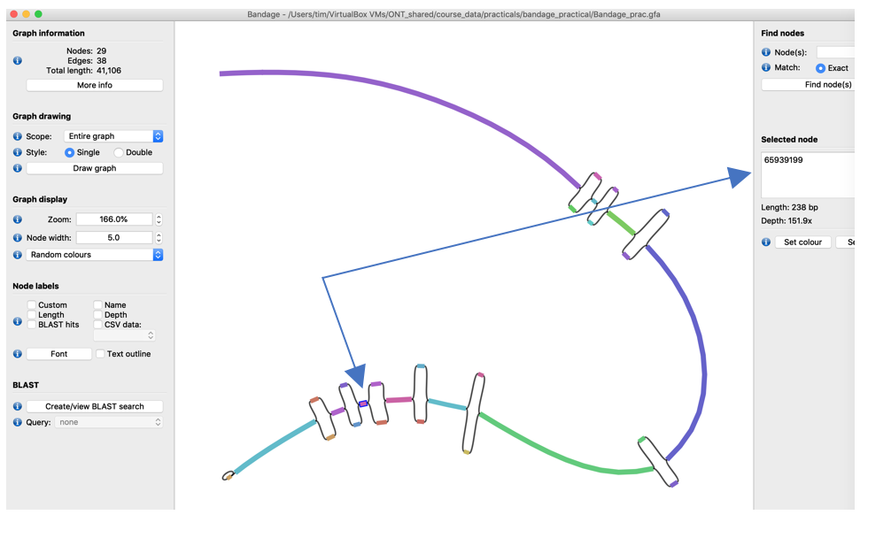

2. Copy its sequence to the clipboard using the Output menu of Bandage

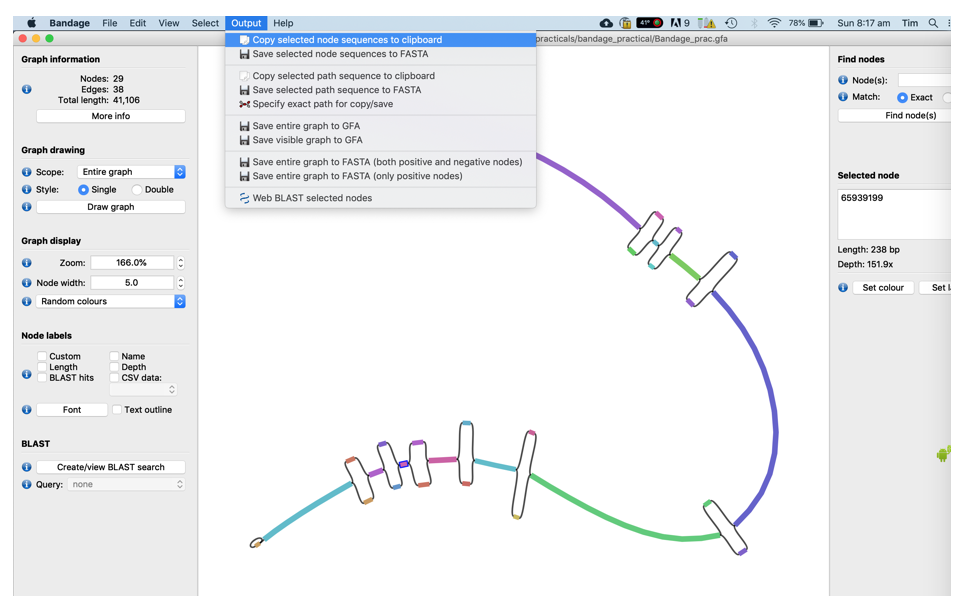

3. Open FireFox, go to www.google.com, search for "NCBI blastn" and click on the first link

4. In the BlastN window
 1. Paste the sequence into the text field 
 2. Select the NR database to search against
 3. Select “blastn” as the search tool
 4. Press "Blast"
 
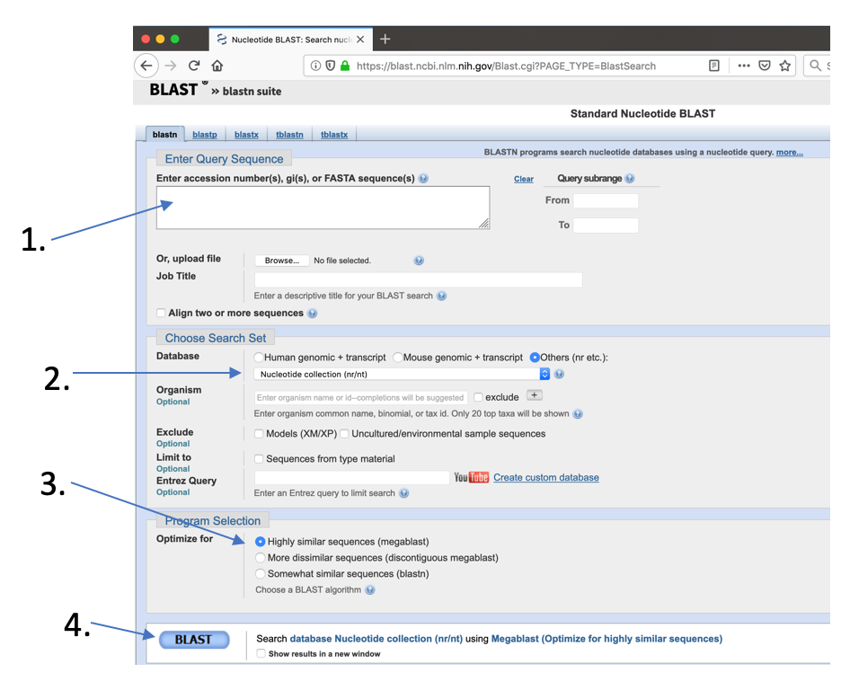
 
Check the best hits and remember the gene annotation.

Now do the same with the 2nd last node (node ID 65999159)

   
  <ol start ="3">
   <li>What are the annotations? What does it tell you about the bubbles that are connected to those nodes?</li>
 </ol>

So, let’s assume we decided that the 3 bubbles at the end of the graph are due to different alleles of the same gene. However, due to the bubbles we did get a fragmented assembly on these sections. With the information we just got we can resolve the bubbles in 2 ways:

1. We randomly choose one path through the bubbles, remove the other one and create one long “pseudo-haplotype” assembly. This is common practice for most published assemblies
2. We create 2 “pseudo-haplotypes” by writing out 2 sequences for this locus consisting of the two possible paths through the bubbles. 

Let’s choose option 1 to make it a shorter practical (option 2 is the same thing just repeated, of course).
<ol>
 <li>Randomly choose one node of each of the last 3 bubbles (press Ctrl while clicking to select more than one node) and delete them using the Edit->Remove Seleciton from Graph function (you could take the one with higher coverage)</li>
</ol>

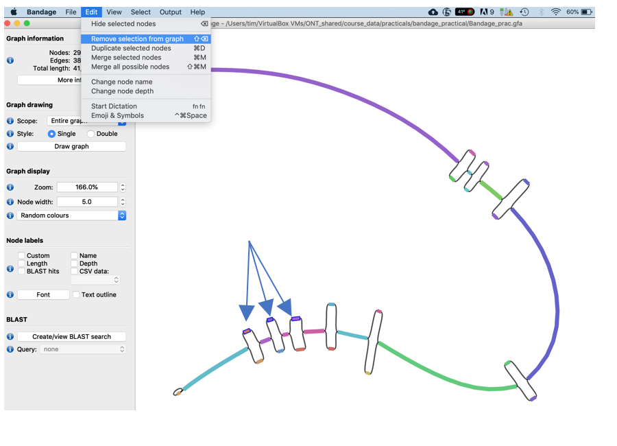

<ol start="2">
 <li>Now merge the remaining nodes together using the Edit -> Merge all possible nodes function</li>
</ol>

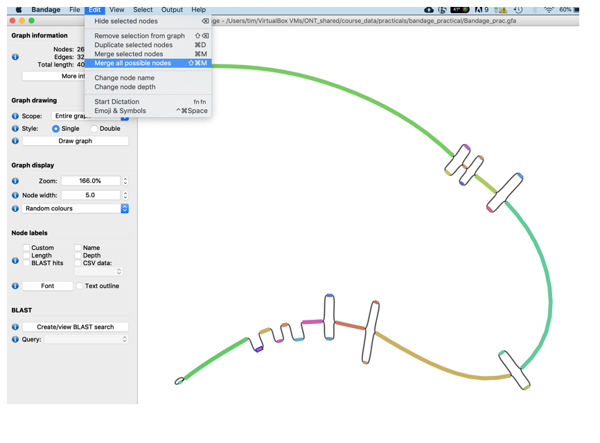

<ol start="3">
 <li>To make the graph a little nicer, i.e., remove the edges press the Draw graph button again. You should now see the graph merged extended graph.</li>
</ol>

 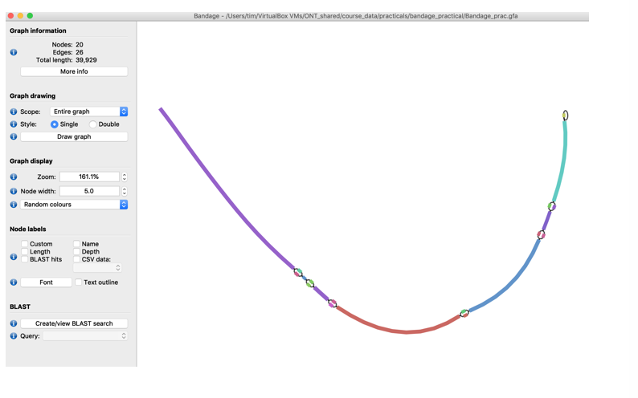
 
<ol start="4">
 <li>Finally, write the new merged assembly  sequence out in fasta format suing the Output -> Save Entire Graph to FASTA function.</li>
</ol>

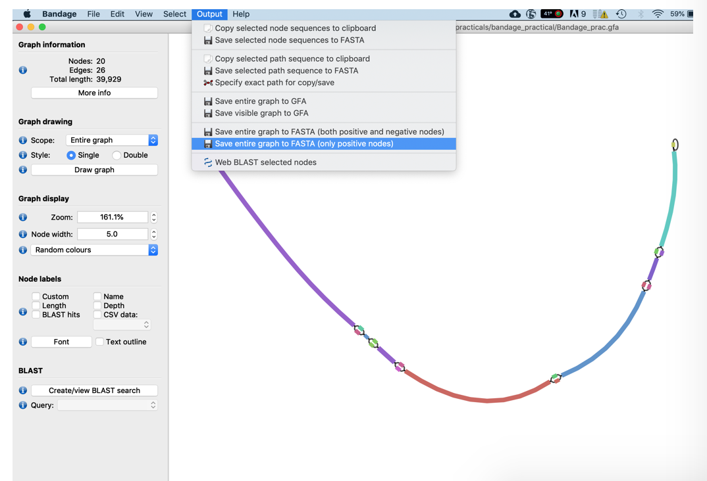

Similarly, you could resolve most bubbles that show similar coverage profiles. However, resolution of more complex bubbles and repeats can be more challenging if not impossible.

   
  For more information about Bandage functions please visit the Bandage webpage or watch the nice youtube introduction video.

