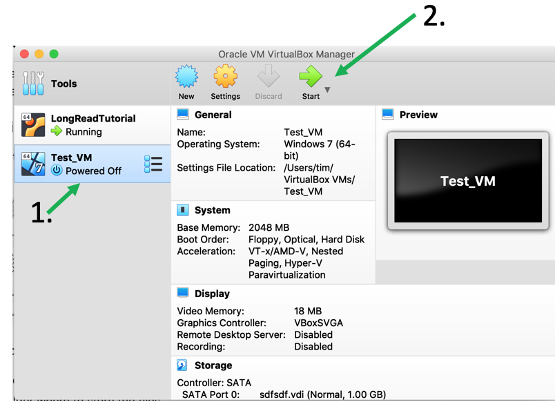
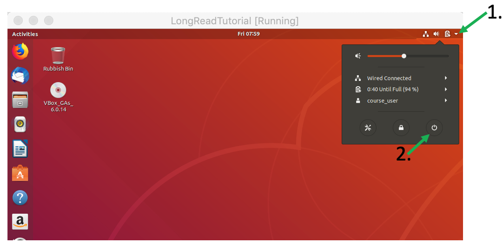
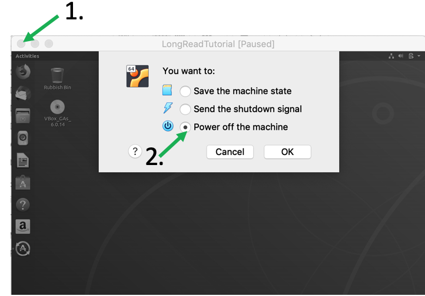
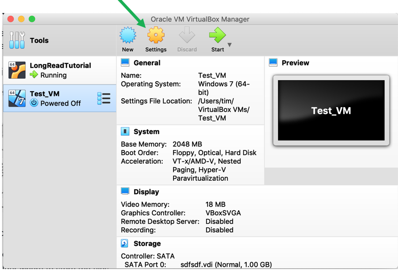
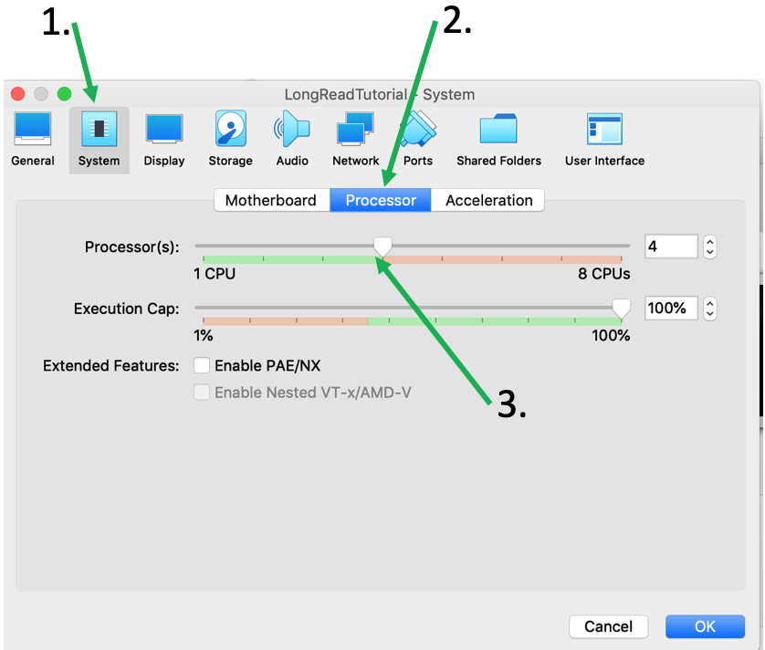

# Frequently Asked Questions

## Virtual Box / Virtual Machine
----

### How Can I start / Stop my Virtual machine?

To start your Ubuntu Virtual Machine simply start VirtualBox, select the Virtual Machine (VM) you want to start in the left menu by clicking it once and then press "Start".

To stop and shut-down the Ubuntu VM you have two options: use Ubuntu's "Shut Down" by first clicking the small arrow in the upper right corner and then click the "Power Off button" as shown below:

or simply close the window with the "X" icon on the corner of the window and select "Power Off Machine" and press OK.

## Why is my VM window so small?

The msot likely reason is that you didn't install the *Virtual Box Guest Addition*. Please see section 2 in the [Set Up](SU.md) section.

## Why are the icons and fonts so small in my Ubuntu VM?

If you installed the *Virtual Box Guest Additions* properly you will be able to set the font size and zoom for your Ubuntu.

In the *View* menu of the Ubuntu VM window got to *Virtual Screen 1* and select the *Scale to 150%* option (or whichever scaling is best for you).

## Why is my Ubuntu VM so slow?

One reason could be that your VM does not have enough resources. Per default you installed the VM using only one CPU/processor. However, most modern computers are much stronger so you could increase the number of processors used.

First, shut down you Ubuntu VM. In the VirtualBox window select the VM you would like to change and press *Settings*.

In the new menu select *System* and look for the *Processor* tab. Here you can adjust the number of processors used. I recommend to use not more than half of your available processors (the maximum number you can use on your computer is shown in the menu).

Similarly, you can adjust the RAM settings in the *Motherboards* tab if you want to increase the RAM used by Ubuntu.

When you're done adjusting everything just click *OK* and re-start your VM

