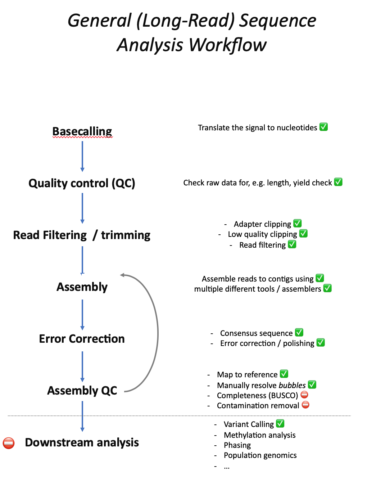

# Overview 

[](index.md) [](index.md) [](SU.md)

## Motivation

The motivation for these tutorials was to give people without bioinformatics experience an entry-level introduction to sequence analysis, specifically whole-genome sequencing (WGS) using long-read data analysis with focus on Oxford Nanopore data. 

As an introduction the tutorials won't cover advanced tool use or workflows but are intended to give people a starting point and basic understanding of general sequence analysis workflows. This includes the general steps but also raise awareness for potential problems and pitfalls. 

## Tutorials

The tutorials are organised in the order they would potentially be executed in a common whole-genome sequencing project. However, they don't have to be executed in a specific order. All tutorials stand alone and can be done without the need to do previous tutorials.

Although the focus of these tutorials is on the analysis of long-read Oxford Nanopore data most steps and tools also apply for other long-read technologies such as PacBio and even Illumina short-reads. All steps and/or tools are marked according to the technologies they can be used for: 
*  for Oxford Nanopore specific tools/steps
*  for general Long-Read technologies
*  for steps/tools that can be used for long-read as well as short-read data

## Workflow and steps covered

The general workflow of Long-Read and Short-Read whole genome sequence analysis is very similar, especially with regards to quality control and the often iterative assembly process using different assemblers to find the best possible genome assembly. The tutorials on this page cover most steps of the general workflow. However, so far only few post-assembly downstream analyses are covered:

The steps that are covered by thi

## Questions and Answers

Throughout the tutorials you will find questions that are intended to make you think about what exactly you are doing, what to look for and help you to self-check. The answers to each question can be found on the page after each tutorial.

## Appendix

Additional information about the tutorials, e.g. software list, references and tutorial data, as well as background information  about (long-read) sequence analysis can be found in the [Appendix](APP.md) section.
