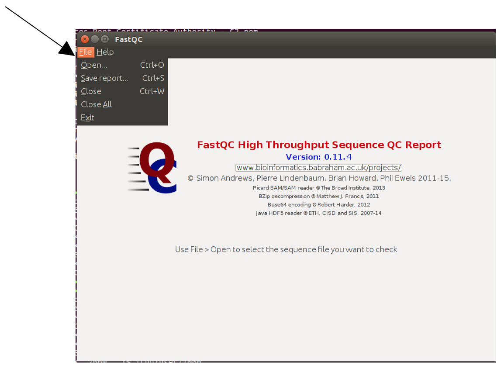
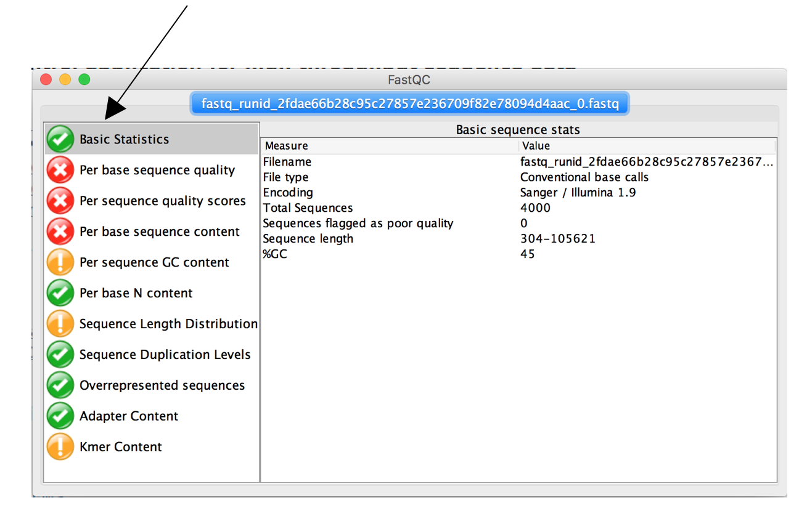
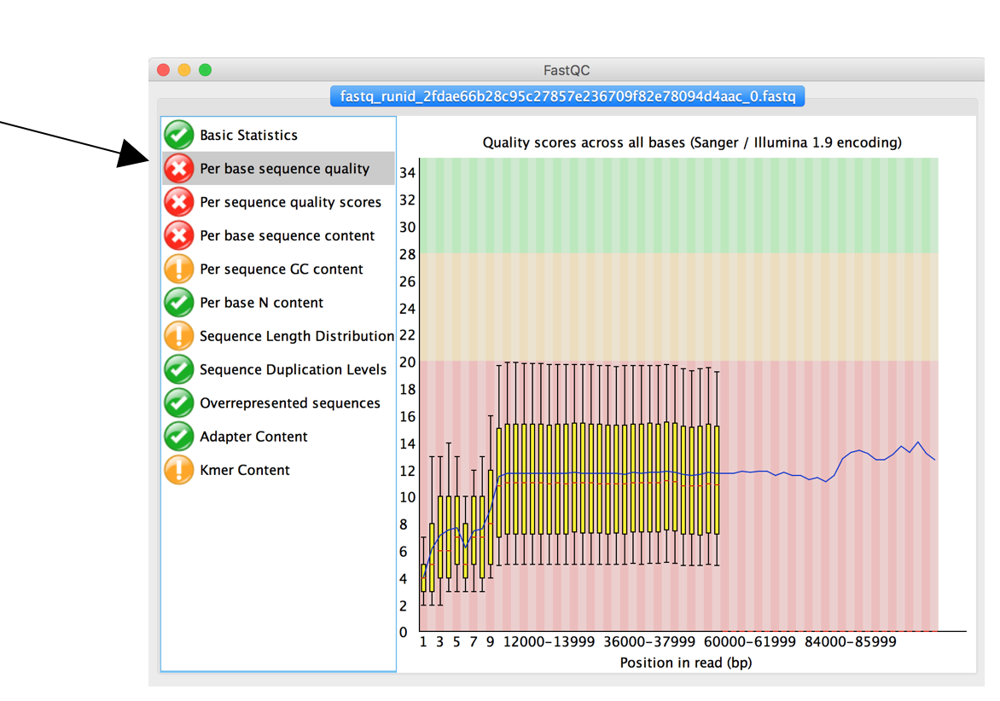
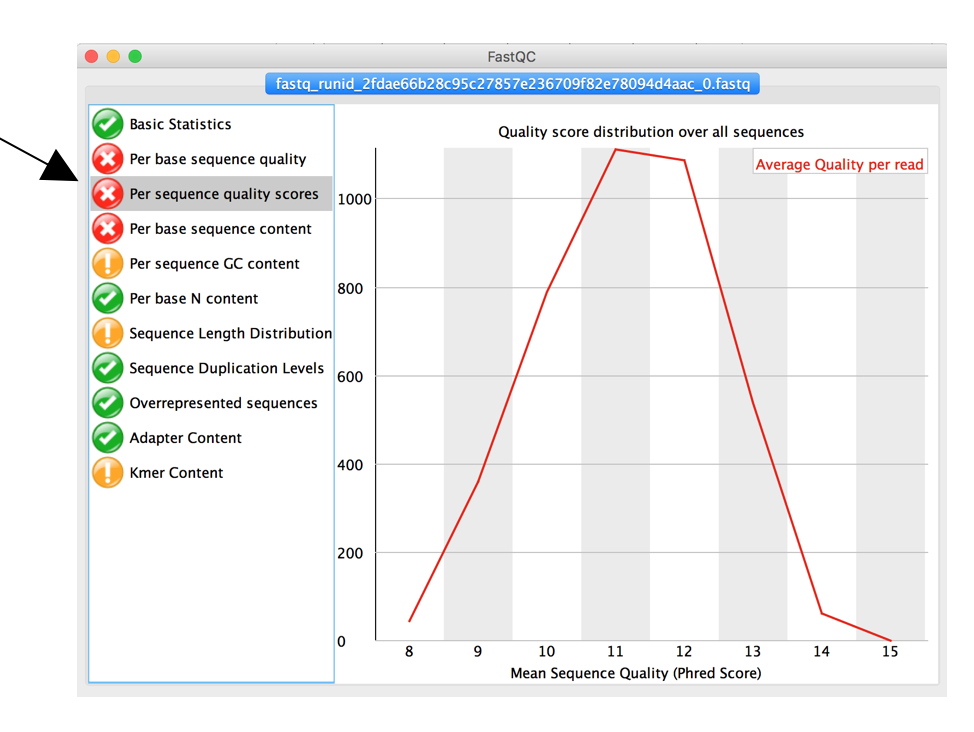
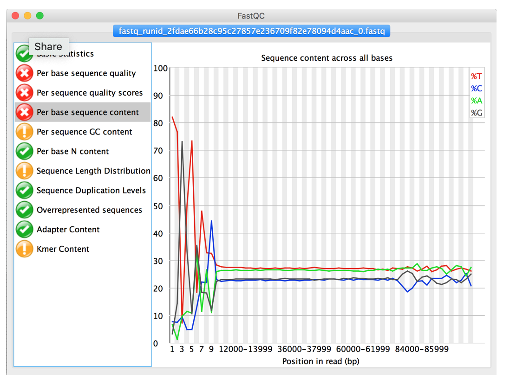
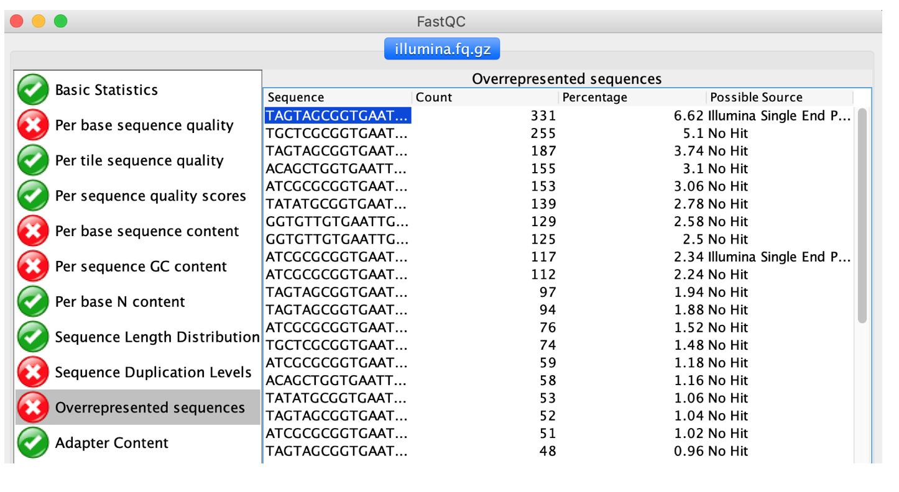

# Quality Control using FastQC 

[](QC.md) [](index.md) [](QC_P.md)

FastQC is one of the most common tools for quality control of sequencing data including Illumina, Ion Torrent, Oxford Nanopore and PacBio data. Input to FastQC is a sequencing file in (compressed) fastQ format containing reads and quality information.

Type `fastqc` on the command-line to open its graphical user interface and load the fastq file of the reads that passed Albacore's quality thresholds.

After loading the first tab will show you some basic statistics about your fastq file and raw sequences.                             

The second tab “Per Base sequence quality” shows mean and standard deviation of sequencing quality for each position in all reads of your data set. Low quality regions may have to be removed, low quality reads filtered.

The tab “Per Sequence Quality scores” shows the average quality score distribution of your nanopore reads. 

The tab “Per base sequence contents” show the average ratio of As, Ts, Cs and Gs in your data set. ”Clean” data without sequencing should show almost parallel/flat lines for all four nucleotides. Trailing or leading peaks indicate indicate sequencing problems and may have to be trimmed.

   
  <ol>
    <li>How many reads are in the sample?</li>
    <li>What is the mean quality?</li>
    <li>Overall, how good is your data?</li>
    <li>Are there areas that should be trimmed?</li>
  </ol>

[Answers](APP_ANS.md#quality-control-using-fastqc)

Another useful feature of FastQC is the “Overrepresented sequences” feature. FastQC analysis the raw reads and tries to identify identical sub-sequences that are “over-represented” in the data. These could indicate PCR primers, sequencing adapters, multiplexing barcodes etc that are still contained in the data and will have to be trimmed/removed.

Load the provided illumina test data (illumina.fq.gz) located in the practical directory and check the “Overrepresented sequences” tab. 

  
  <ol start="5">
    <li>Are there any sequence parts that should be removed as part fo the Quality Control step?</li>
  </ol>

[Answers](APP_ANS.md#are-there-any-sequence-parts-that-should-be-removed-as-part-of-the-quality-control-step)
 

   
  Be aware that the <i>Over-represented sequences</i> feature may return false results for small datasets or highly repetitive genomes/sequences. Just because FastQC flags it does not mean it has to be trimmed. As usual, tools give you an indication of potential problems to help you make a decision. <b>Never trust a computer</b> 

