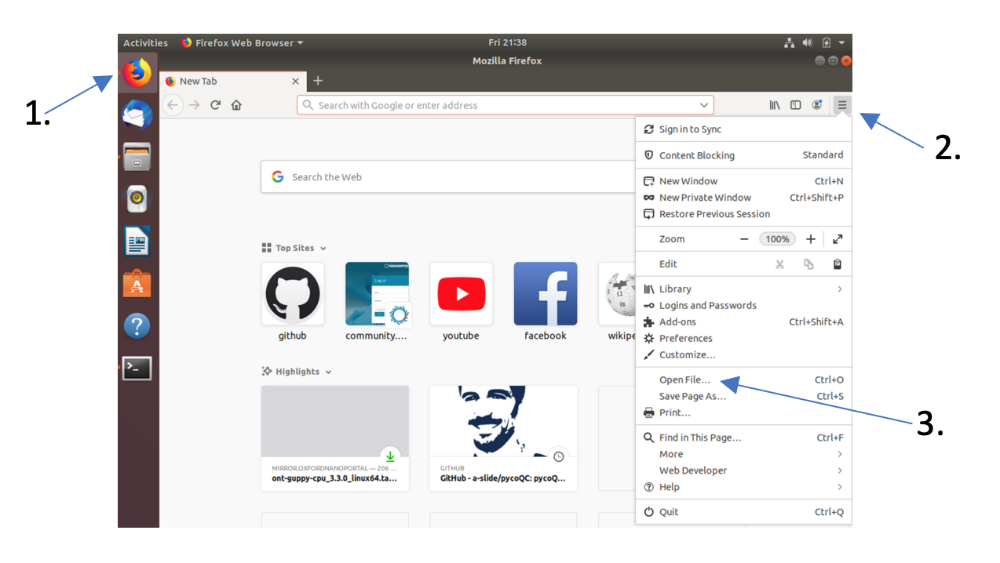

# Quality Control using PycoQC 

[](QC.md) [](index.md) [](QC_M.md)

PycoQC is a data visualisation and quality control tool for nanopore data. In contrast to FastQC it needs a specific sequencing_summary.txt file generated by Oxford nanopore basecallers such as Guppy or the older albacore basecaller.

In the directory *qc_practical/summaries* you will find 3 different run-directories each containing a sequence summary file.  From within the qc_practical directory call PycoQC on one of the summary files, e.g., run_1:

```
pycoQC –f summaries/run_1/sequence_summary.txt –o run_1.html
```

The above command will create the file run_1.html with multiple plots and summary statistics. This file can be opened in your web browser, e.g., via the “Open File” menu button in FireFox



Inspect the different plots and statistics

<div style="background-color:#cfedfe;border-radius:5px;border-style:solid;border-color:gray;padding:5px">
   
  <ol>
    <li>How many reads do you have in total?</li>
    <li>What is the average, minimum and maximum read length, what is the N50?</li>
    <li>What do the mean quality and the quality distribution of the run look like? Remember, Q10 = 10% error rate</li>
  </ol>
</div>

In addition to read statistics PycoQC also gives a lot of information about the sequencing run and the flowcell itself such as sequencing run, yield over time, number fo active pores etc.

<div style="background-color:#cfedfe;border-radius:5px;border-style:solid;border-color:gray;padding:5px">
   
  4. Have a look at the “Basecalled Reads PHRED Quality” and “Read length vs PHRED quality plots”. Is there a link between read length and PHRED score?<br><br>
  5. Have a look at the “Read Length over Experiment time” plot. Did the read length change over time? What could the reason be?<br><br>
  6. Given the number of active pores, yield over time, and channel activity over time, do you think this was a successful sequencing run? Why/why not?<br>  <br>
  7. Inspect the “output over experiment time” graph. Can you explain the shown curve-pattern? Would you have stopped the run earlier? Think about how the MinION works, especially with regards to adjustment of the applied currents.<br><br>
  8. If you want to you can generate the PycoQC plots for <i>run_3/sequencing_summary.txt</i> and compare it to run_1. What are the differences?
</div>
