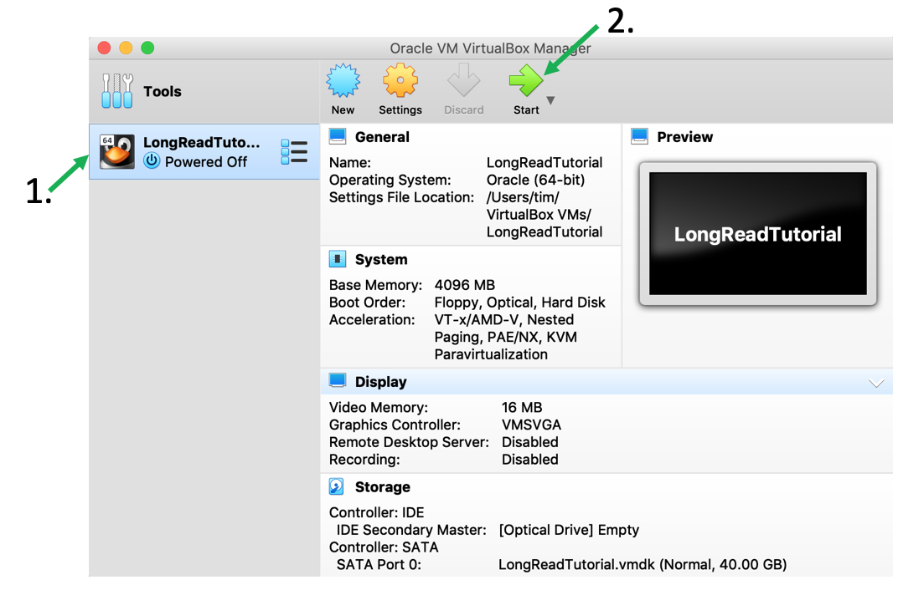
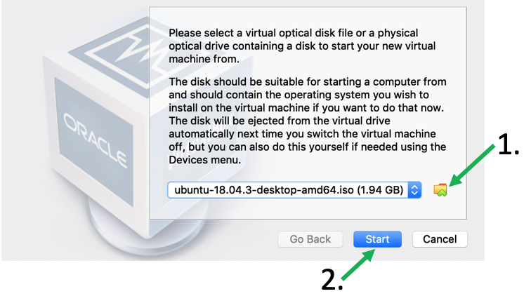
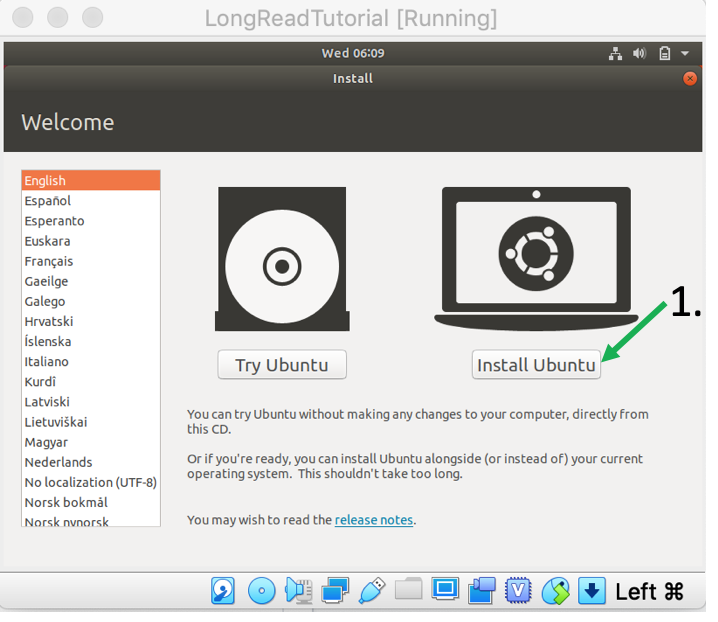
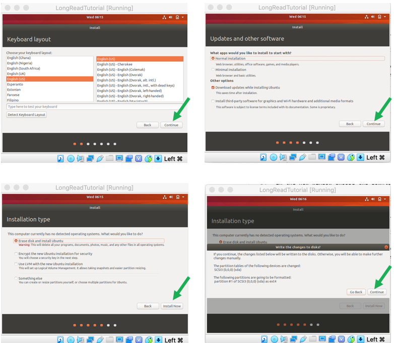
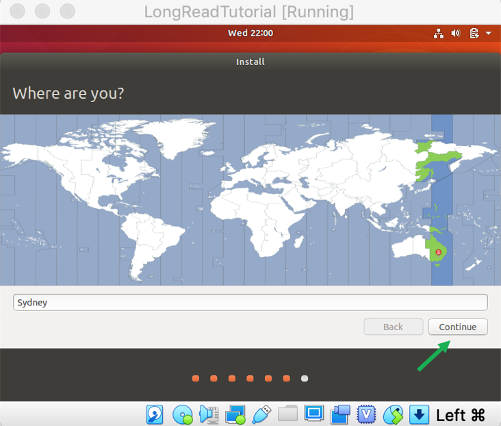
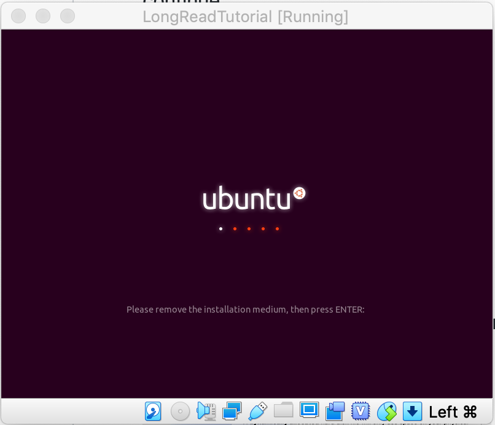

# Tutorial Set Up

[](OV.md) [](index.md) [](BAT.md)

These tutorials are written for a linux operating system, specifically Ubuntu 18.04, with a [number of bioinformatic tools](APP_TOOLS.md) installed. However, this page gives detailed instructions on how to set up a tutorial environment on any computer using *VirtualBox*.

Setting up the environment is easy, free and should not take longer than 15 minutes, depending on your internet connection. Additionally, you will be able to install your tutorial environment on a USB stick or external harddrive or copy it to any other computer to work on it where ever you'd like.

#### Windows 10 - Ubuntu sub-system
Windows 10 users may also be able to run the install script and download the data into the Ubuntu sub-system. However, this has not been tested and it might be easier to just follow the instructions below to set up a Ubuntu VM.

#### Mac users
The easiest way especially for inexperienced Mac users is to follow the instructions below to set up a VirtualBox environment. However, it is also possible to install [the tools used](APP_TOOLS.md) in the tutorials and download [the tutorial data](APP_DATA.md) yourself. Unfortunately, the install script that downloads and sets up the Linux environment will (most likely) not work for Mac. You will therefore have to figure out potential installation problems yourself.

#### Linux users
If you are already working on Ubuntu 16.04 or 18.04 you can directly run the install script and download the tutorial data as described below. For other linux distributions the installation script should also work for other linux distributions, although this has so far not been tested.

   The installation script will make changes to your *.profile* and may create additional folders such as *~/github* and symlinks in */etc/bin*. If you don't like this please install the tutorial tools manually. 

## Compute Requirements
-----

To set up the virtual environment and do the tutorial I recommend a minimum of
* 40GB free disk space
* 4GB of RAM
* 4 CPU cores, i.e., a *Quad-core* processor as is found in most laptops

It will be possible to run the tutorial with half of the required specs but it will be slow and you will have to delete temporary files as you may not have enough free space to save all files at the same time.

   You can install the virtual environment on a USB stick or external hard-drive in case you don't have 40GB on your computer to spare. An advantage is that you can take the tutorial with you and continue/finish it on another computer. However, make sure that the harddrive/stick has high read/write specs. Otherwise execution of the different commands may be very slow. 

## Virtual-Box-Set-Up
-----

   You can install the virtual environment on a USB stick or external hard-drive in case you don't have 40GB on your computer to spare. An advantage is that you can take the tutorial with you and continue/finish it on another computer. However, make sure that the harddrive/stick has high read/write specs. Otherwise execution of the different commands may be very slow. 

### 1. Download and install VirtualBox

To create the tutorial Environment first download the free software [VirtualBox](https://www.virtualbox.org/wiki/Downloads) as well as the *Expansion Pack*.

After double-clicking VirtualBox installer follow the instructions on the screen to install.
The downloaded *Expansion Pack* will be used later.

### 2. Download Ubuntu 18.04 image

Next you will need a Ubuntu disk image that you can download for free from [here](https://ubuntu.com/download/desktop). After clicking the "Download" button just wait until the download starts and safe the file to your preferred location.

### 3. Create a Virtual Machine for the tutorial

After the installation is finished open VirtualBox and press the "New" button to create a new Virtual Machine.

In the new window
1. Give the machine a name, e.g., LongReadAnalysis
2. Choose a folder where to store the files
3. Set the type to "Linux"
4. Set the version to "Ubuntu (64-bit)
5. Press "Continue"

Next use the slider to set the RAM to "4092 MB" and press "Continue"

Leave the next window as is and press "Create"

Now choose the format and size of the stored files. in the next window choose "VMDK (Virtual Machine Disk)" and continue.

Set the next settings to "Fixed size", continue ...

... choose the path fo the VMDK file (should already be in the folder you chose before) and set the size to "40GB". Then press "Create".

Now VirtualBox will create a 40GB big file in the specified folder. This may take a while ...

### 4. Install Ubuntu in your virtual machine

When done the newly created Virtual Machine (VM) should appear in VirtualBox in the menu on the left. Select the VM by clicking on it in the menu and then start it up.

In the new window choose the downloaded Ubuntu *iso* file and press "Start" 

   Make sure your internet connection is working as Ubuntu will download updates and additional packages during the installation process.

The language should already be English. Start the installation by pressing "Install Ubuntu"

In the next windows the defaults should be ok, so just press "Continue" for "Keyboards" and "Install". Then press "Install Now" and "Continue" when asked to "Write the changes to disk"

   Initially the screen may be quite small. We will change this as soon as Ubuntu is installed properly.

Next you'll have to configure your Ubuntu. First, set the time zone but clicking on the map and press continue.

In the next screen you can set your user details. You can configure these values as you like. However, for simplicity I recommend setting the name, user name and password all to "course_user", the computer name to "LongReadVM" and also check the "Log in automatically" option so oyu don't have to type in a password on start up. You window should look like th one below:

   When typing the password Ubuntu will not show the actual characters you type but blank them out with black dots. That is a normal security feature, it will still remember your password correctly.

When done press "Continue". Ubuntu should now start the installation process. This may take a few minutes depending on your computer. When the installation process is done press "Restart Now". When asked to "Remove the disk" just press "Enter", VirtualBox will automatically remove it on restart.

  

Congratulations, you now have a Ubuntu 18.04 Virtual Machine to work with! :)

