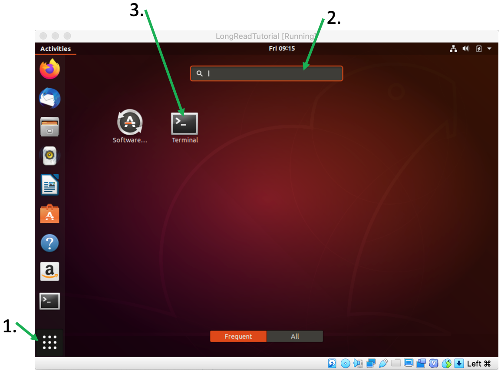
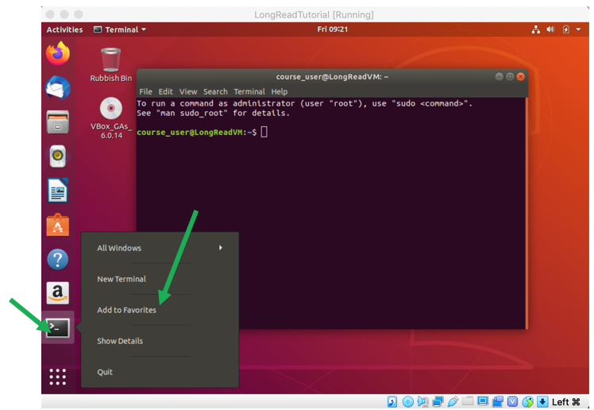

[](SU_GA.md) [](index.md) [](SU_D.md)

# Installation of packages, tools and data

Installation of all tools and packages needed can be done using the [install script]() of the tutorial. First open FireFox in your Ubuntu VM, navigate to this page, i.e., https://timkahlke.github.io/LongRead_tutorials/SU.html, and download the [install script]().

Now open the command line terminal: Open Ubuntus App Center, type *terminal* in the search field and click the *Terminal* app.

  

This will open a command line window, your main "Bioinformatics tool".

   
  You can also add the <i>Terminal</i> app to the side-bar of you Ubuntu so you don't have to always open it through the App Center. When the Terminal is open simply right-click on it in the side-bar and choose <i>Add to Favourites</i>. 
  
    

Now execute the file you just downloaded. By default Firefox downloads files into the *Downloads* folder in your home directory. To execute the install script type 

    sudo bash ~/Downloads/install_script.sh

This will automatically download and install all needed tools and packages and set-up your tutorial environment.

   
  Depending on your internet connection and computer this may take up to an hour. However you can just leave it running in the background until it's done.

After the install script is done close the terminal and re-open it. Your Ubuntu is now ready to do some serious bioinformatics! 

Last but not least [download the tutorial data](SU_D.md) and you are finally ready to go.
