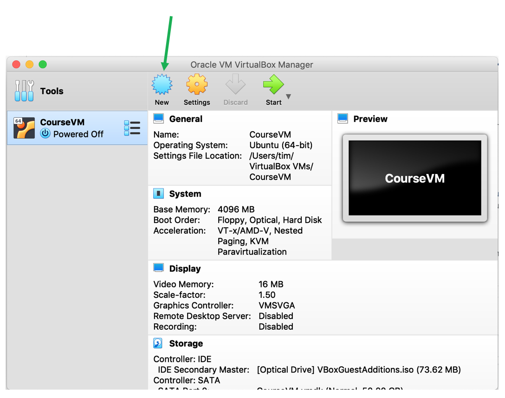
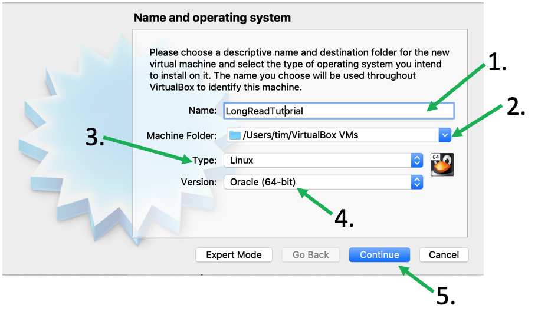
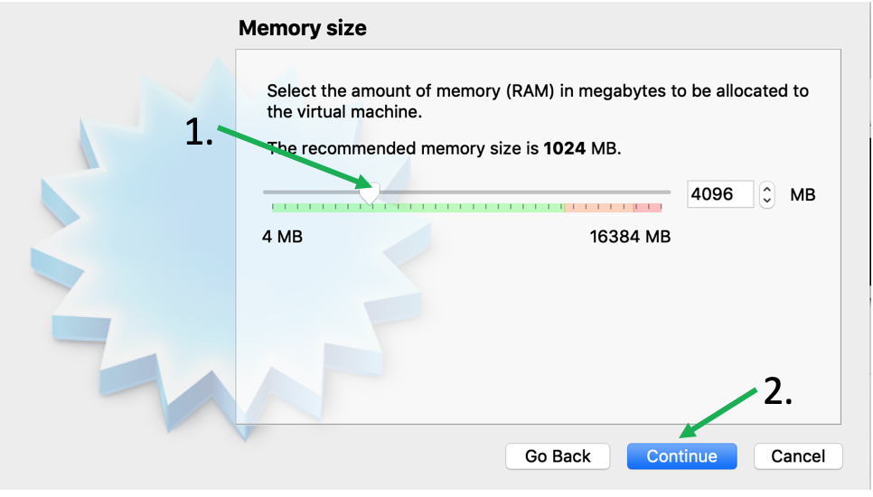
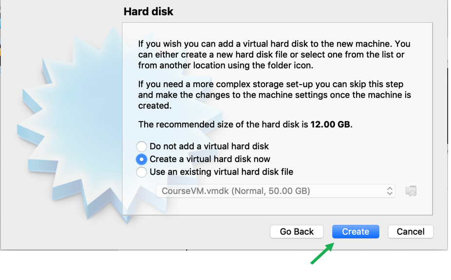
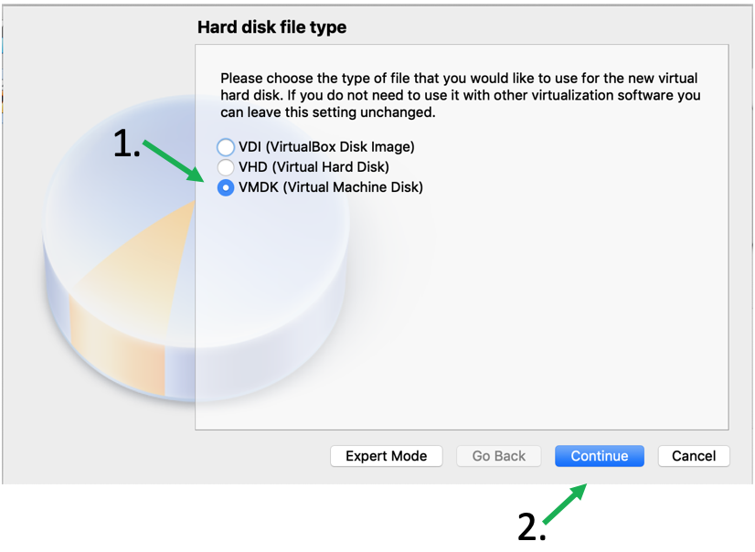
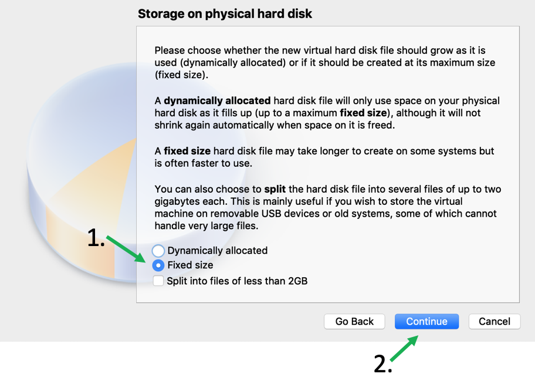
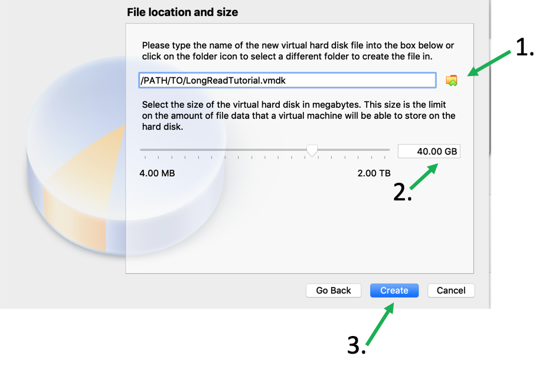
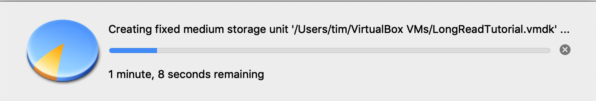

# Virtual-Box-Set-Up

[](SU.md) [](index.md) [](SU_U.md)

   You can install the virtual environment on a USB stick or external hard-drive in case you don't have 40GB on your computer to spare. An advantage is that you can take the tutorial with you and continue/finish it on another computer. However, make sure that the harddrive/stick has high read/write specs. Otherwise execution of the different commands may be very slow. 

## 1. Download and install VirtualBox

To create the tutorial Environment first download the free software [VirtualBox](https://www.virtualbox.org/wiki/Downloads) as well as the *Expansion Pack*.

After double-clicking VirtualBox installer follow the instructions on the screen to install.
The downloaded *Expansion Pack* will be used later.

## 2. Download Ubuntu 18.04 image

Next you will need a Ubuntu disk image that you can download for free from [here](https://ubuntu.com/download/desktop). After clicking the "Download" button just wait until the download starts and safe the file to your preferred location.

### 3. Create a Virtual Machine for the tutorial

After the installation is finished open VirtualBox and press the "New" button to create a new Virtual Machine.

In the new window
1. Give the machine a name, e.g., LongReadAnalysis
2. Choose a folder where to store the files
3. Set the type to "Linux"
4. Set the version to "Ubuntu (64-bit)
5. Press "Continue"

Next use the slider to set the RAM to "4092 MB" and press "Continue"

Leave the next window as is and press "Create"

Now choose the format and size of the stored files. in the next window choose "VMDK (Virtual Machine Disk)" and continue.

Set the next settings to "Fixed size", continue ...

... choose the path fo the VMDK file (should already be in the folder you chose before) and set the size to "40GB". Then press "Create".

Now VirtualBox will create a 40GB big file in the specified folder. This may take a while ...

Congratulations, you created a *Virtual Machine* for your Ubuntu. Now you will have to [Install Ubuntu in your Virtual Machine](SU_U.md)
