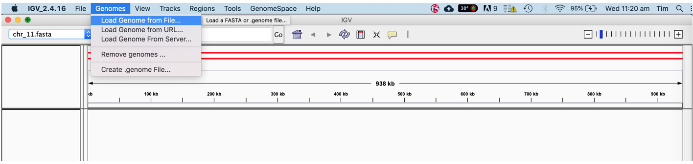
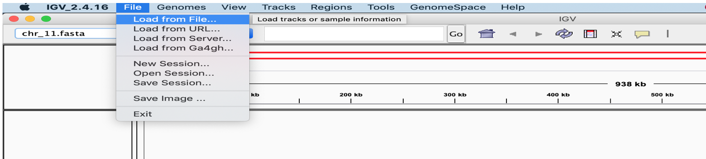
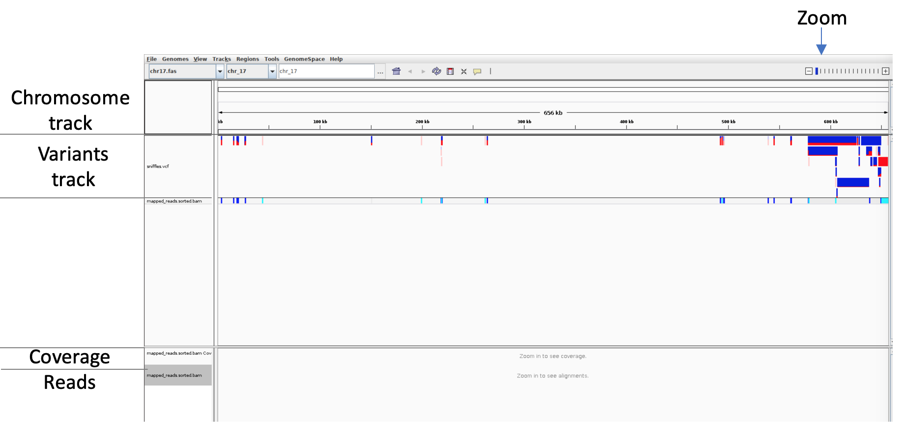

# Variant calling using Sniffles 

[](VC.md) [](index.md) [](BAN.md)

Despite its error rate recently released tools such as Sniffles have shown the ability to call structural variants using noisy long-read data. 

Here, we will use [minimap2](https://github.com/lh3/minimap2) and [Sniffles](https://github.com/fritzsedlazeck/Sniffles) to call variants on the provided data and visualise it using the [Integrative Genome Browser (IGV)](https://software.broadinstitute.org/software/igv/).

First, change into the *variant_calling_practical* directory. Concatenate all fastq files from the *~/course_data/precompiled/guppy_output/* into one fastq file and use minimap2 to map them to the reference.

```
cd  ~/course_data/practicals/variant_calling_practical

cat ~/course_data/precompiled/guppy_out/*.fastq > ./all_guppy.fastq

minimap2 --MD -a  ~/course_data/prcompiled/chr17  \
~/course_data/practicals/basecalling_practical/all_guppy.fastq > mapped.sam
```

The additional minimap2 options in the above command will write the output in SAM in stead of PAF format (option –a) and also include the MD-tag in the annotation needed by sniffles (--MD).

Before we can use the mapped file we have to do real bioinformatics: file conversion!

 Use the tool [samtools](http://www.htslib.org/) to 
 1. Convert the sam file to bam (a binary sam format) using samtools’ view command
 2. Sort the bam file (needed for fast access) using samtools sort command
 3. Create an index of the bam file (needed by IGV) using samtools index command

```
# Convert to bam file
samtools view –bS mapped.sam > mapped.bam

# Sort the bam file
samtools sort –o mapped.sorted.bam mapped.bam

# create an index file
samtools index mapped.sorted.bam
```

Run sniffles on the sorted bam file to write a out a Variant Call Format (vcf) file.

```
sniffles -m mapped.sorted.bam -v  variants.vcf
```

To visualise the sniffles results we will use IGV:
 1. Type igv on the command line to open IGV
 2. Click the Genomes -> Load Genome menu and open the chr17.fasta in the precompiled folder
 
 

 3. Use the File -> Load from File menu to load variants.vcf and the mapped.sorted.bam files you just created
 
  
 
 Your screen should now look something like this
 
  

<div style="background-color:#fcfce5;border-radius:5px;border-style:solid;border-color:gray;padding:5px">
   
  The <i>Variant track</i> shows the suggested variants. Transparent variants fall below Sniffle's quality or abundance threshold. The colours indicate the frequency of the shown variant.
</div>

Get familiar with IGV. Things to try are
 * Zoom in until you see the reads mapped to the reference, Right-click on the bam-track and select “Collapse” and “link supplementary alignments” 
 * Hover over a  variant to see a description of the variant

<div style="background-color:#cfedfe;border-radius:5px;border-style:solid;border-color:gray;padding:5px">
   
  <ol>
    <li>What type are the majority of the variants?</li>
    <li>Is there anything weird going on with the coverage at variant positions? What could be the explanation?</li>
  </ol>
</div>


